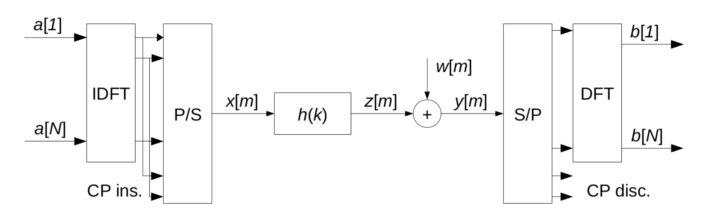

# OFDM odissey part 2
Giovedì 10 ottobre 2019

In un sistema QAM convenzionale si ha una costellazione di punti (16 nel caso del QAM16), ognuno corrisponde ad un simbolo che può essere trasmesso. Per ovviare al problema del whitenoise, basta aggiungere un po' di "spazio" (in frequenza e fase) tra un punto QAM e un altro.

Ad esempio, prendiamo i due segnali $x_0$ e $x_1$, che costituiranno:

$$ y = 2x_0 + x_1 $$
Se ad esempio viene trasmesso un altro segnale $y = 2x_0+2_x1$, i punti QAM di $x_0$ si sovrappongono a quelli di $x_1$, quindi si annullano.

La soluzione potrebbe essere quella di dividere il canale in sottoportanti in modo che i segnali non interferiscano tra di loro.
In pratica:
* si divide il segnale in più segnali narrowband;
* si applicano filtri che interpolano il segnale in pezzi differenti delo spettro separatamente (per ogni narroband);
* lato ricevente, si riapplicano i filtri inversi per "ricostruire" i singoli pezzi del segnale trasmesso originariamente

## Cos'è OFDM
OFDM è ispirato dai principi di divisione dello spettro e inserimento di ogni simbolo in una frazione dello spettro. 

L'idea di OFDM è:
* associare ciascun simbolo QAM ad una frequenza
* siccome l'antenna ragiona in tempo, è necessario applicare una inverse discrete-time fourier transform (IDFT). Ho quindi ora i segnali espressi in tempo (e non in frequenza)
* effettuare una conversione parallel-to-serial (in pratica, si leggono i punti uno ad uno e si piazzano nel canale)
* inviare il segnale convertito nel canale. Notare che l'effetto della convoluzione effettuata dal canale (in tempo) corrisponde ad una moltiplicazione di segnali nel dominio di frequenza.
* lato ricevente, si effettua una conversione serial-to-parallel, piazzando ogni simbolo in una posizione specifica di un vettore, in base al tempo in cui appaiono
* effettuare una discrete frequency fourier transform (DFT) per andare dal dominio del tempo a quello della frequenza.

Per quanto osservato al punto 3, i vari $b[n]$ (quindi quello che effettivamente riceviamo) sono l'effetto della convoluzione che avviene nel canale:

$$ b[n] = a[n]\cdot H[n] $$
dove $H[n]$ è la frequenza di risposta del canale.

Otteniamo quindi *n-sottoportanti*, ognuna trasmettente in un canale differente. Nella conversione parallelo-seriale del canale, oltre a tutti gli n-simboli da trasmettere, vengono ripetuti anche alcuni dei primi simboli trasmessi (si chiama __Cyclic Prefix__). Lato ricevente, esso viene scartato.

Siccome la DFT è lineare, l'output del canale è la somma di tutto quello che avviene al suo interno, quindi il rumore può essere "sommato" ad ogni singolo termine.

## Cyclc Prefix
Prima di tutto, esso evita l'__inter-block interference__. Quando trasmetto un segnale su un canale, esso reagirà con la __impulse response__, quindi il simbolo in realtà verrà trasmesso più volte, con diverse intensità e attenuazioni. Quando poi la trasmissione di un segnale si interrompe, in realtà il ricevente continua a ricevere degli eco relativi agli ultimi dati/simboli trasmessi. Quindi, se subito dopo il primo blocco di dati se ne trasmette un altro, i primi pezzi di esso subiranno interferenze dal primo blocco di dati trasmesso. Grazie al __cyclic-prefix__, se è lungo abbastanza, opera come buffer/separazione tra i blocchi di dati (al posto di usare un silenzio radio). Quindi, lato ricevente, se li scarto, viene eliminata l'inter-block interference.

Inoltre, siccome il cyclic prefix è la ripetizione della prima parte dei dati alla fine, quando si calconano i vari $x[m]$ (simboli) da trasmettere, basta "andare avanti" con la DFT oltre gli $N$ punti dell'input ($N+C$).  In pratica:

$$ x[m] = $$
$$ \sum a[m]e^{2\pi j} : m = 1...N$$
$$ x[m-N] : m = N+1,..,N+C $$

Alla fine di tutti i calcoli slide 10, l'output è l'input moltiplicato per il dominio di frequenza: $b[n] = a[n]H[n] (+ noise)$. L'unico trick usato, invece di scrivere il cyclic-prefix come sull'equazione qua sopra, è stato usare la trasformata di fourier discreta inversa anche per esprimere il *CP*, in quanto la IDFT è periodica.

## Design of OFDM System
1. Il __CP__ deve essere più lungo del _channel impulse response time_ nel dominio discreto, altrimenti avremmo l'inter-block inferference e quanto trasmesso in una sottoportante verrà "replicato" (parzialmente) anche in alcune altre sottoportanti vicine (perché si desincronizza, in qualche modo).
2. I calcoli della slide 10 assumono che il canale non cambi nel corso del tempo: il canale quindi deve essere statico nel corso di tutta la DFT in modo da trasmettere tutti i simboli prima che il canale cambi, altrimenti si ricade nell'__inter-channel interference__.
3. Il *cyclic prefix* dovrebbe essere il più piccolo possibile, in modo da non sprecare banda ed energia. Tuttavia, se è troppo piccolo incorriamo nei problemi descritti nel punto 1.
4. La dimensione della *DFT*, al contrario, dovrebbe essere il più grande possibile, in quanto così facendo il rapporto tra dati trasmessi e cyclic prefix aumenta (perché il cyclic prefix ha lunghezza costante). Non troppo, perché sennò:
    * Si incorre in quanto scritto nel punto 2;
    * Per demodulare i dati, bisogna attendere fino alla fine della ricezione dell'intero blocco di dati, quindi se la DFT è troppo lunga si introduce latenza. Quindi anche qua, in base alla QoS richiesta, si scelgono le dimensioni della DFT.

## OFDMA (no slide)
OFDM può essere usato per il multiplexing in un singolo canale. Ogni utente avrà la sua trasmittente e andrà su canali differenti. Se la trasmissione è sincrona, ogni utente potrà utilizzare una singola frequenza, grazie alla linearità della DFT. Questo approccio si chiama *OFDMA* (Orthogonal Frequency Division Multiple Access).

## 5G Typical example
In 5G, OFDM è usato come OFDMA in downlink (dalla stazione base verso lo smartphone).
Cambiando la configurazione (slide 13), si possono ottenere soluzioni a bassa latenza (come nel caso di una banda a 240Hz) o ad alta latenza (1ms, tipo quella con banda 15Khz, che è l'unica disponibile nel 4G). Si nota come nel 4G si ha già 1ms di latenza introdotta solo dalla demodulazione!!!