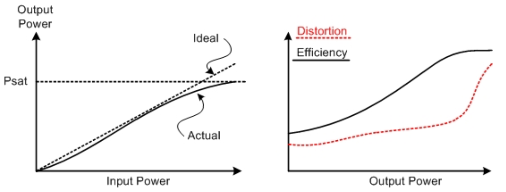
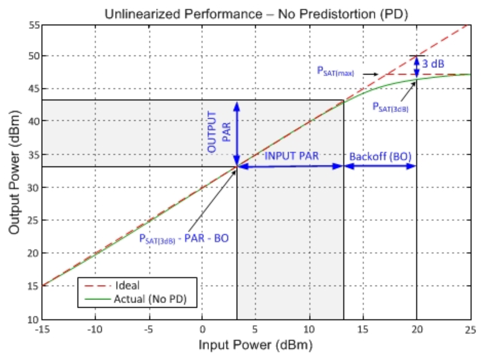
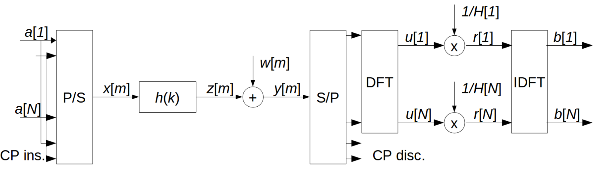

# Downlink Multiple Users. FEC in 5G systems. Peak to Average Power Ratio. SC-FDMA (first part)

Lunedì 21 Ottobre 2019

## OFDMA (Multiple access with OFDM)
L'idea è di dare a ciascun utente una frazione dello spettro. Per prima cosa bisogna assicurarsi che ci sia sincronia tra la stazione base (gNB) e l'utente (gUE). Inoltre è importante che ciascun dispositivo sia informato che i dati stanno arrivando (quindi penso in pratica debba fare silenzio per non interferire).

L'elemento base che si può allocare all'utente in 5G è il __Resource Block__, che è formato da 12 elementi (_resource elements_). 

Un problema è decidere che frequenze allocare a chi. In base alla QoS richiesta dal servizio a cui l'utente accede le cose possono variare.

Lo scenario più semplice è quello di avere più datarate possibile in download per tutti gli utenti assieme. I problemi quindi ora sono:
1. A che utente trasmettere;
2. Che blocco di risorse / portante / frequenza riservare all'utente (_subcarrier allocation_), che è un problema a variabile discrete;
3. Quale potenza dare a ciascuna portante (_power allocation_), che è un problema a variabili continue.

I problemi di allocazione a variabili discrete sono in genere molto complessi da risolvere, ma nel caso della _subcarrier allocation_ le cose sono più semplici. Nel caso volessimo allocare ciascuna sottoportante a ciascun utente, la cosa intelligente sarebbe allocarla all'utente con il maggior *channel gain*: la velocità è ottenuta come prodotto di $power \times channel$ e il $power$ è fisso! 

Per il caso della _power allocation_, abbiamo che la capacità totale è data dalla seguente formula:

$$ capacity = \sum_{n=1}^{N} log_2(1+\frac{(P(n)|H_n^{U_n}|^2}{\sigma_w^2}) s.t. \sum_{n=1}^{N}P(n) \le \bar{P}$$
dove $U_n$ indica l'indice dell'utente "attivo" nella sottoportante $n$. Analiticamente:

$$U_n = argmax_{m \in {1,..,N}} |H_n^{(m)}|^2$$

In pratica il problema di trovare la capacità si ottiene applicando il waterfiling algorithm con il moltiplicatore di lagrange: trovare $P(n)$ con il waterfiling su $\{H_n^{(U_n)}\}$

Per calcolare il datarate che ogni utente riesce ad ottenere basta applicare la formula della capacità del canale usando le varie $H_i[n]$

Un problema è che se un utente (user 1) ha allocato tutti i canali con le condizioni migliori, con la formula della capacità (e il waterfiling) verrà data tutta la potenza a lui e quindi nessuna potenza agli altri utenti (che quindi non riceveranno nessun dato). Per ovviare a questo problema e riuscire a garantire una _QoS_ a ciascun utente si può usare un approccio di __weighted capacity__:

$$capacity = \sum_{n=1}^{n} w^{(U_n)} log_2(1+\frac{(P(n)|H_n^{U_n}|^2}{\sigma_w^2})$$
dove $w^{U_n}$ indica il "peso" che viene dato ad ogni utente (e quindi dipende dall'utente e dal tempo). A livello pratico il peso è solo un numero, non rappresenta una grandezza reale o un datarate reale: serve solo a prioritizzare utenti con il peso maggiore. Sto giro non si può usare il waterfiling ma si usa un approccio diverso che massimizza appunto il __weighted sum rate__ (ovvero la formula precedente). Scegliendo i pesi in modo furbo possiamo assicurarci *fairness* (correttezza sportiva) tra gli utenti (ovvero essi ricevono più risorse bilanciate)

## Uplink
La differenza tra l'uplink e il downlink è che gli amplificatori di segnale dello smartphone sono più semplici, meno potenti ed efficenti rispetto a quelli usati dal *carrier*.
Per questo motivo viene utilizzata una versione modificata di OFDM.

I circuiti che implementano l'amplificazione si comportano in maniera non lineare rispetto alla potenza:
* Prima di tutto c'è un limite di potenza oltre al quale non si riesce ad andare (_saturation effect_, __Psat__).
* Inoltre, quando ci si avvicina al valore di __Psat__ le cose vanno un po' a remengo: aumenta la distorsione e aumenta l'efficenza (quanta potenza si ottiene in uscita rispetto alla potenza di ingresso). Arriviamo quindi ad una dicotomia: sarebbe ottimale trasmettere con un'alta potenza (perché l'efficenza sarà maggiore) ma allo stesso tempo usare una bassa potenza per evitare grandi distorsioni. 

L'input power medio è 2.5db e l'output power medio è circa 33db. Si tollerano input power al massimo di 13db e output power di 43db. 

Se usiamo una costellazione QAM16 per codificare i dati si ha che i vari simboli hanno potenze molto diverse (dipende dalla loro distanza dall'origine). Si ha che la potenza media è 10 e quella massima è 18. Si ha che il __peak to average power ratio__ è 1.8. Nel grafico della figura soprastante questo valore è rappresentato dalla lunghezza del segmento _input par_.

Nel dominio temporale in OFDM stiamo trasmettendo il simbolo x[n], che è una combinazione lineare di N simboli di costellazione:

$$ x[m] = \frac{1}{\sqrt{N}} \sum_{n=1}^{N} e^{2\pi j \frac{(n-1)(m-1)}{N}} a[n]$$

Il caso peggiore è che lo stesso simbolo sia trasmesso in tutte le N sottoportanti e il simbolo ha la massima potenza di costellazione (ad esempio un punto al vertice di una costellazione QAM). 
Il problema è che la potenza massima richiesta per trasmettere questo simbolo sfigato su tutti i canali incrementa linearmente con N (il numero delle sottoportanti). Per 128/256 sottoportanti il requisito di potenza è troppo elevato per essere implementato su uno smartphone (tipo 200 watt).

## Single Carrier Frequency Division Multiple Access (SC-FDMA)
Si fa un mischiotto tra OFDM e le trasmissioni a singola portante:
* Basso __Peak To Average Power Ratio__
* Si riesce ad operare nel dominio di frequenza con DFT Fourier
* Viene ereditata da OFDM la possibilità di allocare sottoportanti ad utenti differenti.

Soluzione (non tanto complicata (cit.)):

* a[n] sono i simboli QAM che vogliamo trasmettere.
* é come se prima della conversione P/S facessimo una DFT e una IDFT di seguito, per questo dobbiamo farle anche lato ricevente. E' che lato ricevente non si possono semplificare, perché va eliminato l'effetto del canale, mentre lato trasmittente si possono semplificare;
* Il canale effettivamente fa una moltiplicazione tra i vari $x[i]$ e l'impulse response del canale (penso) $H[i]$, quindi alla ricezione devo dividere per $H[i]$ per recuperare il simbolo trasmesso

Osservazioni:
* se una sottoportante ha un casino di rumore, facendo la IDFT alla fine (lato ricevente, __channel equalization__), quel rumore contagerà anche le altre sottoportanti e causerà un deterioramento delle performance globali
* Lo schema risolve il problema del Peak To Average Power Ratio perché esso non aumenta con *N* (al contrario di OFDM).
* In OFDM volevamo una dimensione del blocco (quindi N) più grande possibile per assorbire il cyclic prefix. Siccome il cyclic prefix viene comunque usato è preferibile anche in questo caso avere una dimensione di N gigante.
* In OFDM è molto semplice allocare sottoportanti diversi ad utenti diversi. In SC-FDMA è un po' più complicato:
    * Si allocano $M < N$ sottoportanti ad un utente
    * Nei primi M simboli si inseriscono le DFT transform dei simboli QAM. Nel caso estremo in cui ogni sottoportante è assegnata ad un utente singolo si ottiene un comportamento analogo ad OFDMA (con quindi un grande Peak to Average Power Ratio). In 5G il numero magico è 12.