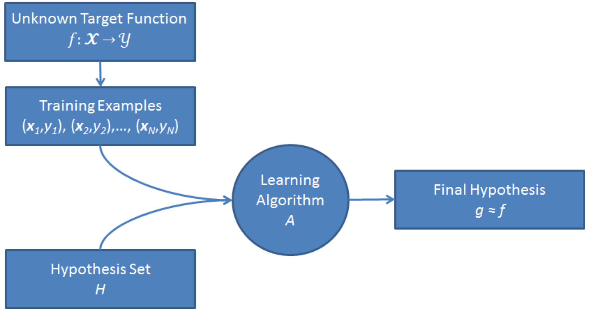

# Lezione 3 - Supervised Learning

## Supervised Learning
L'apprendimento supervisionato funziona ricevendo un certo feedback
Si vuole tradurre un insieme di dati in ingresso $X$ in un spazio di output $Y$. Ad esempio, $x \in X$ potrebbe essere un'email, mentre $y \in Y$ la classificazione "spam"/"no spam".
L'output può essere:
* Una classificazione: $Y = {-1;+1}$ (classificazione binaria)
* Una multiclasse: $Y = {1,...,m}$
* Una regressione: $Y = \R$, in cui dato un oggetto bisogna predire un numero (quantità di ordini in un dato giorno per una data azienda ad esempio).

Anche in questo caso c'è un _oracolo_ che può funzionare:
1. in modo deterministico: $f: X \to Y$, ma quando viene fatto machine learning, ovviamente, non si ha a disposizione questa funzione (sennò che apprendo a fare?!). Inoltre, questa è una semplificazione del secondo caso illustrato qua sotto;
1. in modo stocastico, che sceglie un oggetto $x$ in $X$ secondo una certa probabilità $P(x)$ e sceglie $y$ in $Y$ in base a $P(y|x)$.

Inoltre, disponiamo di alcune "osservazioni" delle associazioni (oracolo) $\{(x_1,y_1),...,(x_n,y_n)\}$ (dati storici).

L'obiettivo dell'apprendimento è quello di selezionare la funzione ipotesi $g: X \to Y$ dall'insieme $H$  utilizzando i *training data*. Una volta fatto, si va a misurare l'**errore empirico**, ovvero quante volte otteniamo una classificazione non corretta sui dati di training. 

L'errore atteso su coppie qualsiasi pescate in accordo alla probabilità $P(x,y)$ è chiamato **errore ideale** e dovrebbe essere il minore possibile. In altre parole, questa metrica indica l'errore di classificazione di un input non presente nel training set. L'ipotesi $g$ infatti dovrebbe generalizzare bene e cercare di minimizzare il rischio ideale.

Cosa importante, questo oracolo non sempre è una funzione, questo perché può capitare che ad uno stesso *x* corrispondano *y* diversi.

L'assunzione di base che si fa in ML (in particolare in apprendimento supervisionato) è che c'è un *processo stocastico* (relativamente) semplice che spiega i dati che osserviamo. Ad esempio, prendendo due immagini che rappresentano la stessa cifra, è evidente che ci sono dei tratti caratteristici comuni. In pratica, si assume che il comportamento stocastico dell'oracolo sia abbastanza regolare.

Il machine learning non è magia: lo spazio delle ipotesi non può coincidere con tutte le funzioni calcolabili, quindi è necessario fare delle assunzioni sulla funzione oracolo: queste assunzioni prendono il nome di **bias induttivo**, composto da:
* l'insieme delle ipotesi
* l'algoritmo di apprendimento, che definisce in che modo andiamo ad esplorare lo spazio $H$ (in base a questo ordine verrà determinata che $g$ scegliere)

In altre parole, fanno parte del bias induttivo:

- Come vengono rappresentati gli esempi;
- Come viene modellato lo spazio delle ipotesi *H*;
- La funzione obiettivo per la ricerca nello spazio *H*, cioè come viene scelta la funzione *h*.

#### Es: regressione polinomiale

> $TRAIN = \{(x_1,y_1),...,(x_n,y_n)\}, x,y \in \R$

Si vuole trovare una funzione polinomiale in grado di approssimare i punti

$$ h_w(x)=w_0+w_1x+w_2x^2 +···+w_px^p ,p ∈ \N $$

Bisogna innanzitutto minimizzare l'errore empirico:

$$error_s(h_w) = \frac{1}{n}\sum_{i=1}{n}(h_w(x_i)-y_i)^2$$

In questo caso il bias induttivo è assumere che esista una funzione polinomiale in grado di approssimare i vari punti.

Lo spazio delle ipotesi diventa quindi l'insieme dei vari polinomi e l'apprendimento viene fatto sui vari coefficenti.

Dobbiamo quindi scegliere tra questo spazio un grado $p$ che va a limitare i possibili polinomi (definzione di $H$) e i vari parametri $w$ della curva (ricerca nello spazio $H$).

Matematicamente, dato un determinato $p$, il problema diventa:
* $[X]i =[1,x_i,x_i^2,...,x_i^p]$ (l'i-esma riga della matrice $X$)
* $[y]_i = y_i$ (l'i-esima riga del vettore $y$ è l'i-esimo valore del training set)

dobbiamo quindi trovare $w$ tale che $Xw \sim y$

Per il dataset di training, bisogna minimizzare l'errore empirico (n.b: $\alpha$ è definito a priori, è un "iperparametro"):

$$min_w \frac{1}{n} ||y − X_w||2 + \alpha||w||^2$$

Quando $\alpha = 0$ otteniamo la minimizzazione dell'errore empirico. Quando invece $\alpha$ cresce, nella funzione obiettivo li diamo più peso, concedendoci un maggiore errore empirico ma una funzione polinomiale più semplice (più liscia, con valori $w$ più bassi/regolari).

### Iperpiani in $\R^2$

**Iperpiano**: dato uno spazio a $n$-dimensioni, un iperpiano per quello spazio è un sottospazio di dimensione $n-1$. Quindi gli iperpiani in $\R^2$ sono tutte le rette del piano. La caratteristica dell'iperpiano è quella di separare lo spazio in due dimensioni, quindi si possono applicare dei criteri di classificazione (binaria).

Lavorando in $\R^2$ lo spazio delle istanze è definito come:

$$X = \{x | x \in \R^2\}$$

Mentre lo spazio delle ipotesi è dato dalle dicotomie indotte da iperpiani in $R^2$, cioè da tutte le possibili divisioni del piano.

$$H = \{f_{w,b}(x) | f_{w,b}(x) = sign(w \times x + b), w ∈ \R^2, b ∈ \R\}$$

Così facendo vengono prese in considerazione tutte le rette che dividono $\R^2$ in due parti in modo che da una parte l'ipotesi valga 1 e dall'altra -1.

### Cerchi in $\R^2$

Sempre in $\R^2$ è possibile considerare come spazio delle ipotesi tutte le dicotomie indotte da disci in R2 e centrati nell'origine.

> H = {fb(x) | fb(x) = sign(||x||2 - b), w ∈ R2, b ∈ R}

Il che vuol dire che all'interno del disco le ipotesi valgono -1 mentre al di fuori valgono 1.

### Congiunzione di *m* letterali positivi

Lo spazio delle istanze questa volta è dato da tutte le stringhe di *m* bits 

> X = {s | s ∈ {0,1}m}

Lo spazio delle ipotesi è dato da tutte le sentenze logiche che riguardano i letterali positivi l1,l2,...,lm (li è vero se l'*i*-esimo bit è 1) e che contengono solo l'operatore ⋀.

> H = { f{i1,...,ij}(s) | f{i1,...,ij} (s) equivale a li1 ⋀ li2 ⋀ ... ⋀ ij, {i1...ij} sottoinsieme di {1..m}}

# __ESERCIZIO__
Implement polynomial regression using the Ridge Regression method available in scikit-learn, see sklearn.linear model.Ridge() and look at the behavior of the solution when changing the parameter α

