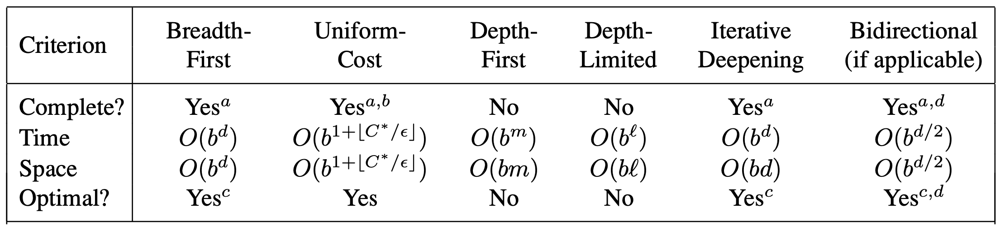

# Lezione 3 - Ricerca non informata
Martedì 8 Ottobre 2019
<!--
_Altre informazioni sul progetto, come l'estensione di un sistema con elementi di intelligenza artificiale.
Oppure studio sperimentale di algoritmi diversi. La presentazione pubblica del progetto dovrebbe dare un bonus, la presentazione di una 20-ina di minuti_

## Formulazione di un problema

Problema definito da 4 elementi:

- Stato iniziale;
- Funzione successore generica;
- Test goal, per sapere se è stato raggiunto l'obiettivo;
- Soluzione come sequenza di azioni che porta dallo stato iniziale ad uno stato goal.

### Esempio del Puzzle


__Azioni__: spostamento dello spazio vuoto, che non può essere spostato ovunque, la funzione successore deve contenere di questo vincolo;

__Stati__: locazione interne dei tasselli;

__Test goal__: è lo stato con i tasselli ordinati (_esplicito_), può essere fornito anche come test implicito.

__Costo del cammino__: si può considerare un +1 per ogni spostamento, in questo caso si cerca di minimizzare il costo.

_La soluzione di questo problema è NP-Hard_
-->
## Algoritmi di ricerca ad albero

L'idea di base è quella di simulare l'esplorazione dello spazio degli stati generando successori degli stati già esplorati (espansione di uno stato).

Si parte calcolando la funzione successore dello stato iniziale, ottenendo dei nuovi stati che diventano i figli del nodo radice, e via via, finché non esploro tutti i possibili cammini.

Una **soluzione** è un cammino dallo stato iniziale ad uno stato goal e non è detto che sia sempre possibile trovare questo cammino.

Durante la creazione dell'albero entra in gioco anche una _strategia_ che sceglie tra i vari nodi ancora da esplorare ne sceglie uno secondo determinati criteri.

È importante andare a differenziare il concetto di stato da quello di nodo:

- uno __stato__ è una rappresentazione di una configurazione fisica;
- un __nodo__ è una struttura dati che appartiene ad un albero di ricerca e che rappresenta un particolare stato.
Il nodo porta anche l'informazione relativa al suo genitore e all'azione da compiere per tornare ad esso.

Le informazioni presenti in un nodo sono variabili e dipendono dalla strategia di ricerca utilizzata.

**Frontiera**: struttura dati che rappresenta la strategia di esplorazione dell'albero, nell'esempio è l'insieme dei figli ancora da esaminare. In alcuni casi è una coda a priorità. Nell'esempio dell'albero non si avrà mai una frontiera vuota (perché ha cammini infiniti)

```javascript
function RicercaAlbero(problema, frontiera) returns una soluzione o un fallimento
    frontiera <- Inserisce(CreaNodo(StatoIniziale[problema], frontiera)
    loop do
	   if Vuota?(frontiera) then return fallimento
	   nodo <- RimuoviPrimo(frontiera) //Dipende dalla strategia
	   if TestObiettivo[problema] applicato a Stato[nodo] then return Soluzione(Nodo)
	   frontiera <- InserisciTutti(Espandi(nodo,problema), frontiera).
	
function Espandi(nodo, problema) return insimeme di nodi
    for each (azione, risultato) in FunzioneSuccessore[Problema](Stato[Nodo]) do
	   s <- un nuovo Nodo
	   Stato[s] <- risultato
	   NodoPadre[s] <- Nodo
	   Azione[s] <- azione
	   CostoDiCammino[s] <- CostoDiCammino[nodo] + CostoDiPasso(nodo, azione, s)
	   aggiungi s a successori
    return succerssori
```

**Quando si genera uno stato e ancora non si è applicato il test di goal non ci si può fermare! Bisogna prima applicare il test di goal sul nodo goal generato (perché ancora non è stato verificato che quello stato generato è uno stato di goal)**.

## Ricerca a grafo
La differenza principale è che, una volta inserito un nodo in frontiera, esso non potra mai esservi re-inserito: in pratica, una volta che si è individuato un cammino che porta da X a Y, non vengono esaminati cammini alternativi (_parsimonia_). Questo permette di ridurre moltissimo il numero di nodi da ispezionare, essendo la strategia immune ai cicli. (**NO_VAX**).

_ha fatto un confronto tra Tree-Search e Graph-Search_.

## Implementazioni
Le informazioni che devono essere rappresentate in ogni nodo sono:
* Lo stato
* I genitori
* I figli, per generare gli stati successori
* La profondità e il costo del cammino
### Strategie di ricerca

Rappresenta la scelta dell'ordine di espansione dei nodi.

Le strategie possono essere valutate secondo vari criteri:

- **Completezza**: la strategia trova sempre una soluzione
- **Complessità in tempo**: quanto tempo è necessario per trovare una soluzione (se esiste).
- **Complessità in spazio**: quanta memoria è richiesta per trovare una soluzione.
- **Ottimalità**: trova sempre una soluzione di costo minimo.

La complessità in spazio e tempo viene misurata in termini di:

* __b__: massimo fattore di branching dell'albero di ricerca, quanti figli può avere un nodo.
* __d__: profondità della soluzione di costo minimo, a che livello dell'albero la trovo (possono esserci più soluzioni di costo minimo anche a livelli diversi).
* __m__: massima profondità dell'albero, che può essere anche infinita.

### Strategie di ricerca non informate

Sono strategie che usano solo l'informazione disponibile nella definizione del problema.

Non vengono usate informazioni a priori per ottimizzare la ricerca.

#### Ricerca a ventaglio (breadth-first, in ampiezza)

Espande il nodo a profondità minore, la frontiera viene implementata con una coda FIFO. Se non ho cammini di costo uniforme, la coda diventa a priorità, con i nodi associati ai cammini pù costosi in fondo. In cima ci sarà il nodo il cui cammino è quello di costo minimo.
Nel caso di un albero binario di altezza/profondità $H$, il costo di memoria (occupazione di memoria) è $2^H$, ovvero molto molto elevata. La garanzia che mi da è quella di trovare sempre una soluzione ottima: se ho due stati goal, uno a profondità 3 e uno a profondità 5, con la ricerca in ampiezza individuo prima quello a profondità 3 (e quindi di costo minimo, visto che ogni arco costa)

C'è un'ambiguità nella definizione dell'ordine dei successori di un dato nodo, che diventa arbitraria.

Questa ricerca risulta completa se il fattore di branching è finito. Il tempo di esplorazione è esponenziale $(1 + b + b^2 + ... + b^d + b(b^{d-1}) \to O(b^{d+1})$

C'è un problema anche per lo spazio, in quanto devo tenere in memoria tutti i nodi che ho analizzato. 

Infine risulta ottima solo se il costi degli archi è costante o quantomeno non decrescente all'aumentare del livello. Infatti, siccome verrà selezionata sempre la soluzione (goal) di profondità minima (perché prima di passare al livello/profondità $i+1$ devo aver esaminato tutti i nodi di profondità $i$), se esistono due nodi goal, $x$ (a profondità $i$) e $y$ (a profondità $i+\epsilon$, con $\epsilon$ positivo) e $y$ è il nodo di costo minimo, l'algoritmo troverà prima $x$ e quindi non arriverà all'ottimalità della soluzione.

#### Ricerca a costo uniforme
E' un caso particolare della ricerca a ventaglio, ovvero è una ricerca a ventaglio in  cui i costi dei singoli passi sono identici.

Espande il nodo a costo di cammino inferiore, la frontiera viene quindi implementata come una coda ordinata per costo di cammino. 

Questa ricerca è completa se tutti i passi costano qualcosa, se c'è un passo che costa 0 o con costo negativo, sorgono alcuni problemi. 

Il costo in tempo è limitato dal costo del trovare il nodo, dal momento che prima di trovare il nodo goal trovo i nodi più "*economici*" e che non sono goal.

Allo stesso modo il costo in spazio è limitato dal costo della soluzione ottima.

L'algoritmo riuslta ottima nel caso tutti i costi siano > 0, in qunato tutti i nodi vengono espansi nel modo "più promettente".

#### Ricerca a profondità (depth-first)

Può essere anche limitata e iterativa (vedi sezioni immediatamente successive)

La frontiera diventa una coda LIFO (pila).

Questa strategia di ricerca **non è completa** perché può essere che ci sia un cammino di profondità infinita o con un ciclo. Se non ci sono cicli e lo spazio degli stati è finito, allora è completa.

Il tempo necessario è $O(b^m)$, il che risulta terribile se _m_ è più grande di _d_, ma se le soluzioni sono dense (vicine tra loro) risulta migliore del breadth-first.

Lo spazio richiesto è invece __lineare__ secondo $O(b*m)$ in quanto per ogni nodo che viene visitato è necessario tenere in memoria solamente i fratelli del nodo espanso.

L'algoritmo **non è ottimo**, in quanto cerca una soluzione generica andando in profondità e non è garantito che la soluzione che trova sia ottima. Nel senso, potrebbe trovare una soluzione a profondità 5 prima di una a profondità 3. Tuttavia, l'occupazione di spazio è lineare rispetto alla profondità, quindi è più efficente a livello di memoria.

##### Ricerca a profondità limitata

Vengono ignorati tutti i figli al di sotto di un certo livello _l_.

```javascript
function RicercaProfonditàLimitata(problema, limite) returns una soluzione o il fallimento/taglio
    return RPL-Ricorsiva(CreaNodo(StatoIniziale[proplema]), problema, limite)

function RPL-Ricorsiva(nodo, problema, limite) returns una soluzione o il fallimento/taglio
    avvenuto_taglio <- false
    if TestObiettivo[problema](Stato[nodo]) then retrun Soluzione(Nodo)
    else if Profondità[Nodo] = limite then retrun Taglio
    else foreach successore in Espandi(nodo, problema) do
        risultato <- RPL-Ricorsiva(successore, limite, problema)
        if result = taglio then avvenuto_taglio <- true
        else if risultato != fallimento then return risultato
    if avvenuto_taglio then return taglio else return fallimento
```

Ovviamente questa strategia è ancora meno completa, in quanto tutte le soluzioni possono essere ancora più profonde.

Tuttavia, l'analisi dell'albero a profondità limitata risulta più efficiente della ricerca breadth-first.

##### Rircerca a profondità limitata iterativa (IDS)

Viene fissato un limite di profondità, che indica l'altezza massima dei nodi presenti nella frontiera. Se entro il limite non viene trovata una soluzione, si re-inizia la ricerca con un limite più profondo, ripetendo il procedimento finché non viene trovata una soluzione. Da notare che quando incremento il limite, la ricerca riparte da zero, perché sarebbe sconveniente tenere in memoria i risultati delle ricerche fallimentari precedenti. Infatti, ogni volta che abbiamo un fallimento con limite $l$, siamo sicuri che, se esiste la soluzione, essa si trova a livello $\ge l+1$.
I nodi vengono visitati al massimo $l+1$ volte (perché per essere arrivati a profondità $l+1$ si sono avuti $l$ fallimenti). I nodi più visitati (cioè quelli in cui ripeto le stesse cose più di una volta) sono quelli più vicini alla radice, quindi l'overhead è contenuto (ogni volta che aumento di livello, aggiungo un numero di nodi pari a tutti i nodi già esistenti + 1).

```javascript
function RicercaApprofondimentoIterativo(problema) returns una soluzione o il fallimento
    for profondità <- 0 to ∞ do
        risultato <- RicercaProfonditàLimitata(problema, profondità)
        if risultato != taglio then return risultato
```

Si ottiene così un compromesso tra lo spazio e il tempo ($O(b^d)$) che risulta più vantaggioso rispetto all'utilizzo di uno dei due algoritmi in modo "puro".

Questa modalità di ricerca è **completa**.

Il tempo necessario è un $O(b^d)$ e lo spazio necessario rimane lineare.

La strategia risulta anche ottima solo nel caso i costi di tutti gli archi siano gli stessi.

##### Ricerca bi-direzionale
Si fanno due ricerche contemporaneamente, una da start a goal e una da goal a start. Ogni volta che si trova un nodo che è raggiungibile sia da start che da goal (quindi un nodo presente sia nella frontiera di start che in quella di goal), si è individuato un cammino da start a goal! La profondità di ricerca è dimezzata.

**Questo tipo di ricerca è applicabile solo se le azioni sono reversibili**

### Riepilogo


# Ricerca Informata

Nella ricerca non informata la strategia di ricerca delle soluzioni è data dall'ordine di espansione dei nodi.

Nella ricerca informata viene utilizzata una __funzione di valutazione__ $f(n)$ (da non confondere con la funzione euristica $h(n)$) per ogni nodo *n* che indica quanto è _desiderabile_ espandere il dato nodo. Questa funzione è realizzata grazie alla presenza di informazioni a priori sul problema da risolvere.

In questo modo è possible utilizzare la funzione per ordinare la coda dei nodi dell frontiera secondo desiderabilità. In pratica, la frontiera è una coda con priorità in cui davanti abbiamo i nodi più desiderabili. Andremo quindi ad espandere il nodo non espanso più desiderabile.

La ricerca **greedy** e __A\*__ utilizzano questi ragionamenti.

Nell'esempio del viaggio da Arad a Bucharest la distanza della soluzione ottima non può essere minore della distanza in linea d'aria.
Inoltre, le città intermedie migliori sono quelle più vicine in linea d'aria alla destinazione.

Tenendo conto di queste considerazioni è possibile utilizzare una funzione di valutazione che, dato uno stato, ritorni la distanza in linea d'aria dal dato stato a Bucharest.

### Rircerca Greedy
Utilizza una funzione di valutazione definita sulla base di una funzione euristica.

> $h(n)$ = stima del costo dal nodo n al goal più vicino

Nell'esempio del viaggio in Romania, $h(n)$ indica la distanza geografica di $n$ da *Bucharest*.

La ricerca greedy espande il nodo che __appare__ essere il più vicino al goal, senza tenere traccia del cammino effettuato. In questo caso quindi viene utilizzata la funzione euristica come funzione di valutazione: $f(n) = h(n)$.

Questa ricerca **non è completa** in quanto può rimanere intrappolata nei cicli. Se si opera in stati finiti e se viene introdotto un controllo per gli stati ripetuti, può diventare completa (gli stati devono comunque essere finiti).

Il tempo è $O(b^m)$ dove *m* è la profondità della soluzione ottima, ma l'utilizzo di una buona euristica può portare dei miglioramenti (perché vado a scartare molti stati che non sono utili).

Lo stesso discroso vale per lo spazio in quanto per ogni nodo deve essere tenuta la stima della funzione di valutazione ($O(b^m)$).

Non è inoltre garantito che la soluzione trovata sia ottima.

### Ricerca A*

L'idea alla base è quella di evitare di espandere cammini che sono già costosi.

* $f(n) = h(n) + g(n)$, in modo da evitare di espandere cammini non promettenti (cammini con costo già elevato)
* $h(n) \to$ funzione euristica per il costo dal nodo n al goal
* $g(n) \to$ costo sostenuto per raggiungere il nodo (n)
* $f(n) \to$ costo totale stimato del cammino che passa da n al goal

A\* usa una euristica _ammissibile_, cioè la funzione $h(n)$ è una sottostima di $h^*(n)$ (costo effettivo per raggiungere il nodo goal a partire da *n*). La distanza in linea d'aria è quindi ammissibile, in quanto non sottostima mai il costo (è la distanza minima possibile in assoluto tra due città).

La funzione $h(n)$ deve ritornare sempre un valore $\ge 0$ altrimenti si potrebbero avere dei problemi, in quanto un costo non può essere negativo (il costo non negativo permette di non preoccuparsi degli stati ripetuti).

Di conseguenza la ricerca A\* su un albero è **ottima**.

Durante l'esecuzione di A\* può comparire all'interno della frontiera un nodo goal, tuttavia se c'è un nodo che viene stimato di costo inferiore, viene espanso quello al posto del nodo goal.
Questo perché A\* cerca la soluzione ottima ed espande il nodo con la funzione di valutazione migliore.

#### Ottimalità di A* (su un albero)

Supponiamo che un goal sub-ottimo $G_2$ sia stato generato e che si trovi nella coda (frontiera).

Sia *n* un nodo non ancora espanso su un cammino minimo verso il goal ottimo *G*.

> $f(G_2) = g(G_2)$	-- perché $h(G_2) = 0$
>
> $f(G_2) > g(G)$	-- perché $G_2$ non è ottimo
> 
>  $f(G_2) ≥ f(n)$	-- perché h è ammissibile (ovvero h fornisce un limite inferiore per f)

A\* quindi non selezionerà mai $G_2$ per l'espansione ($g(n)+h(n) < g(G_2)+h(G_2)$, altrimenti $G_2$ sarebbe il nodo goal ottimo) e di conseguenza verrà estratto prima $G$ di $G_2$.


