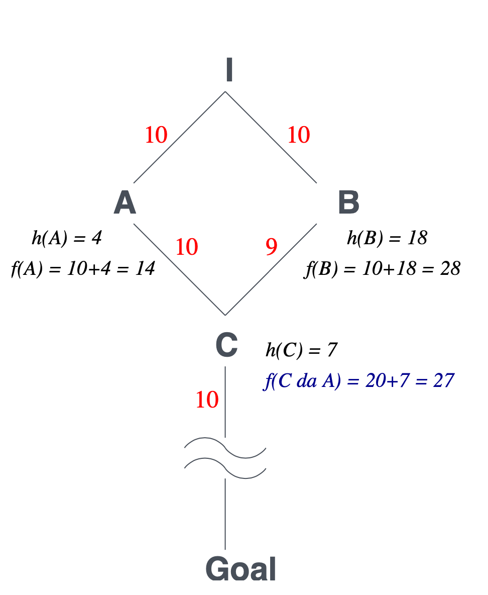

# Lezione 4 - Rircerca informata (A* in poi)

### Ricerca su grafo

Al posto di creare un albero con la replica degli stati si va a sostituire l'albero con un grafo dove i nodi rappresentano gli stati e gli archi sono dati dal collegamento dei due stati.

```
function RicercaGrafo(problema,frontiera) returns una soluzione o il fallimento
	chiuso = insieme vuoto //insieme dei nodi già esplorati
	frontiera = Inserisci(CreaNodo(StatoIniziale[problema])),frontiera)
	loop do
		if Vuoto(frontiera) then return fallimento
		nodo = RimuoviPrimo(frontiera)
		if TestObiettivo[problema](Stato[nodo]) then return Soluzione(nodo)
		if Stato[nodo] non è in chiuso then
			aggiungi Stato[nodo] a chiuso
			frontiera = InserisciTutti(Espandi(nodo,problema),frontiera)
	end
```

## Ottimalità di A* su un grafo

la stessa prova di A\* su un albero non va bene per il grafo.



Nell'esempio del grafo, il nodo $A$ viene prediletto rispetto a $B$ perché ha un valore $f(A)$ minore rispetto a $B$. Inoltre, quando $A$ viene espanso, in  cima alla coda (con priorità) dei nodi di frontiera viene messo $C$, perché ha valore $f(C) < f(B)$. $C$ quindi viene espanso, rimosso dalla frontiera e aggiunto alla lista dei nodi esplorati. Ecco perché, quando si espande anche $B$, $C$ non viene più modificato, perché non appartiene più alla frontiera.

La condizione che $h$ sia ammissibile (deve sottostimare il costo effettivo) non è sufficiente.

Le eristiche devono essere anche **consistenti**, ovvero:

$$h(n) \le c(n,a,n') + h(n')$$

Il valore della funzione euristica calcolata per $n$ deve essere minore o uguale della funzione euristica di $n'$ sommata al costo per spostarsi da $n$ a $n'$ (disuguaglianza triangolare).

In questo modo si ottiene una funzione di valutazione $f$ non decrescente. Nota: tutte le euristiche _consistenti_ sono __ammissibili__!

A\* espande i nodi in ordine di valore rispetto alla funzione di valutazione dei nodi.

## Proprietà di A\*

L'algoritmo è **completo** a meno che non ci sia un numero infinito di nodi con la funzione di valutazione minore e uguale della funzione di valutazione dello stato di goal.

Il tempo di esecuzione è in ogni caso esponsenziale in quanto è necessario andare ad espandere tutti i nodi che hanno la funzione di valutazione più piccola del nodo di goal. Tuttavia, se la funzione euristica fa una buona stima, si arriva prima alla soluzione.

Nel caso pessimo è necessario avere memoria per tutti i nodi del problema.

L'algoritmo però è **ottimo**, in quanto non può espandere un nodo che ha un determinato valore della funzione di valutazione finché non sono stati espansi i nodi con funzione di valutazione minore. Nello specifico, $A*$ può espandere solo alcuni nodi con $f(n) = C^*$ (dove $C^*$ è il costo della soluzione ottima), perché essi potrebbero essere prima del nodo goal nella coda di priorità. Alla fine però, tutti questi nodi verranno espansi, quindi rimossi dalla coda, e si arriverà ad estrarre il nodo goal.

L'algoritmo non è solamente ottimo, non esite algoritmo che trova la soluzione ottima espandendo meno nodi rispetto ad A\*.
Questo perché se un altro algoritmo esplorasse meno nodi allora rischierebbe di andare a scartare dei nodi che potrebbero essere ottimo. (I due algoritmi devono però avere la stessa euristica, altrimenti le cose cambiano).

Il limite di A* è sempre quello dell'utilizzo di memoria. Ecco che, per provare ad ovviare il problema, è presente un algoritmo chiamato IDA\*

### IDA\*
L'idea dell'algoritmo è quella di adottare la tecnica dell'iterative deepening (aumento di profondità di esplorazione iterativa) alle euristiche.

Non inserisce nella coda dei nodi con valore di $f$ maggiore di un certo valore _cutoff $f$_.

Questo valore di _cutoff f_ alla iterazione successiva viene posto uguale al minimo valore di *f* dei nodi non inseriti in coda.

(Ad ogni iterazione prendo il nodo di che non ho inserito in coda e con funzione di valutazione minima e assegno a _cutof f_ il su f-valore, in questo modo quel nodo verrà preso in cosiderazione alla prossima iterazione dell'algoritmo)

Viene così limitato l'uso della memoria.

Ad ogni aggiornamento di _cutof_ devo comunque reiniziare la ricerca da capo.

_Possibile tema di progetto: utilizzo di A\* e IDA\* per la risulzione di 8-puzzle_

Esistono comunque soluzioni migliori: RBFS, MA\*, SMA\*.

## Ricerca Best First Ricorsiva - RBFS

Algoritmo che imita una ricerca in profontidà utilizzando uno spazio lineare, sempre andando a considerare la funzione di valutazione come A* (costo per raggiungere quel nodo + stima distanza da goal).

Invece di seguire indefinitamente il cammino corrente, tiene traccia dell'*f-valore* del miglior cammino alternativo che parte da uno degli avi.

Se il nodo corrente supera l*'f-valore* (valore della funzione di valutazione), la ricorsione torna indietro al cammino alternativo.

Durante il ritorno, si sotistuisce l'*f-valore* di ogni nodo lungo il cammino con il miglior *f-valore* dei suoi nodi figli. Questo perché, durante la ricerca, si ottengono stime sempre più realistiche di $f$ (perché esso era composto anche dall'euristica, che sottostima!). Quindi, la stima del nodo figlio è migliore di quella del padre: posso quindi riportarla e "farla salire".

Come per A\*, la ricerca è ottima se la funzione euristica è ammissibile.

La complessità spaziale è lineare ma la complessità temporale è difficile da definire, nel caso pessimo è sempre esponenziale.

Anche questo algoritmo soffre di un problema simile ad IDA\*, cioè non usano tutta la memoria a disposizione.

_------------------ 
# HA FINITO QUA

## Generare euristiche ammissibili

Considerando l'esempio del puzzle da 8 tasselli.

Per quel problema possono essere trovate due euristiche:

>h<sub>1</sub>(n) = numero di tasselli in posizione errata
>
>h<sub>2</sub>(n) = distanza di Manhattan, cioè il numero di mosse necessarie per portare ogni tassello nella posizione corretta.

*h<sub>1</sub>* è una euristica più semplice da calcolare ma da una sottostima tanto bassa, mentre *h<sub>2</sub>* da una sottostima più accurata rispetto ad *h<sub>1</sub>*.

Conseguentemente è meglio *h<sub>2</sub>* così considero meno nodi e trovo prima il nodo associato ad uno stato ottimo.

Dal momento che *h<sub>2</sub>(n)* è sempre maggiore o uguale di *h<sub>1</sub>(n)* si dice che *h<sub>2</sub>* __domina__ *h<sub>1</sub>*.

Tipicamente ha più senso usare l'euristica dominante, c'è però da considerare il tempo necessario per calcolare l'euristica, in alcuni casi può essere più performante usare un'euristica "peggiore" ma che è molto efficente da calcolare.

### Problemi rilassati

Per facilitare il calcolo si possono togliere alcuni vincoli al problema per applicare una ricerca non informata, in modo da poter usare il valore riscontrato dalla ricerca rilassata come euristica per il problema completo.

Il costo della solzione ottima di un problema rilassato non è più grande del costo della soluzione ottima del problema originario, ed è quindi un euristica ammissibile.

Un esempio dell'uso di questa tecnica è la risoluzione del problema del commesso viaggiatore che può utilizzare un albero di copertura minimo per trovare un limite inferiore al percorso più breve.

## Considerazioni finali su A\*

Si può limitare il consumo della memoria in una modo simile all'iterative deeping al contesto delle euristiche.

Questo si può fare andando ad aggiungere un limite al valore dalla funzione di valutazione.


