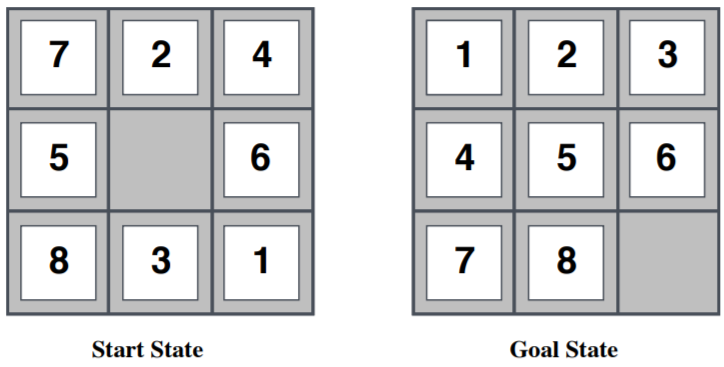
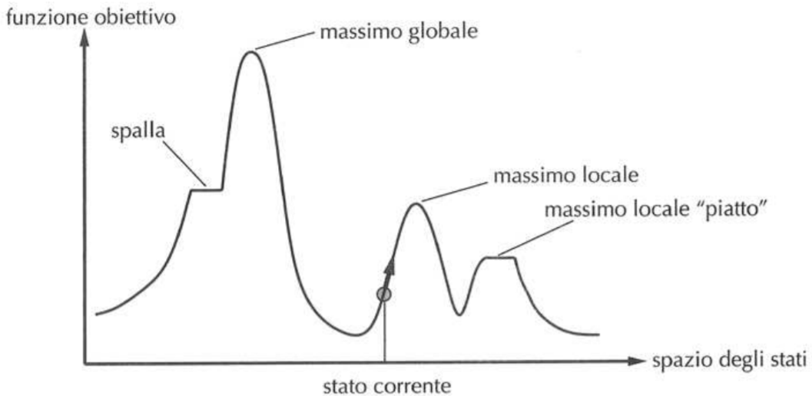

# Costruzione sistematica di euristiche
Martedì 15 Ottobre 2019

## Generare euristiche ammissibili

Considerando l'esempio del puzzle da 8 tasselli.



Per quel problema possono essere trovate due euristiche:

>$h_1(n)$ = numero di tasselli in posizione errata
>
>$h_2(n)$ = distanza di Manhattan, cioè il numero di mosse necessarie per portare ogni tassello nella posizione corretta (numero di quadrati da attraversare per arrivare nella posizione desiderata). Non si cosidera il fatto che lo spostamento di un tassello è vincolato alla posizione degli altri.

**Dominanza**: una eurisitca domina l'altra se entrambe sono ammissibili e i valori della dominante sono maggiori o uguali della dominata. In questo caso $h_2$ domina $h_1$. In generale, è sempre meglio usare l'euristica dominante.

$h_1$ è una euristica più semplice da calcolare ma da una sottostima tanto bassa, mentre $h_2$ da una sottostima più accurata rispetto ad $h_1$.

Conseguentemente è meglio $h_2$ così considero meno nodi (ne inserisco meno in frontiera) e trovo prima il nodo associato ad uno stato ottimo.

Anche se tipicamente ha più senso usare l'euristica dominante, c'è però da considerare il tempo necessario per calcolare l'euristica: in alcuni casi può essere più performante usare un'euristica "peggiore" ma che è molto efficente da calcolare.

### Problemi rilassati
Euristiche ammissibili possono essere derivate da una versione rilassata del problema, quindi una versione "semplificata" del problema originale (nel caso del puzzle di 8 tasselli, non avere l'influenza della posizione delle altre pedine)

Per facilitare il calcolo si possono togliere alcuni vincoli al problema per applicare una ricerca non informata, in modo da poter usare il valore riscontrato dalla ricerca rilassata come euristica per il problema completo.

Il costo della solzione ottima di un problema rilassato non è più grande del costo della soluzione ottima del problema originario, ed è quindi un euristica ammissibile. Il problema è che comunque io la soluzione devo trovarla, quindi se il costo computazionale dell'euristica è tanto alto non conviene utilizzarla.

Un esempio dell'uso di questa tecnica è la risoluzione del problema del commesso viaggiatore che può utilizzare un albero di copertura minimo per trovare un limite inferiore al percorso più breve.

## Algoritmi di miglioramento iterativo

In molti problemi di ottimizzazione non è rilevante come si arriva alla soluzione (come nel TSP, al povero commesso interessa solo la soluzione, non come ci sono arrivato!).

Gli algoritmi di miglioramento iterativo mantengono un singolo stato corrente e tentano di migliorarlo. Considerano l'insieme degli stati raggiungibili e verificano se ce n'è uno che migliora lo stato corrente. Un esempio è lo scambio degli estremi a partire da una soluzione (circuito) per TSP. Si chiama miglioramento iterativo perché cerco, ogni volta che compio un'azione, di migliorare lo stato in cui mi trovo.

Impiegando così spazio costante e quindi sono adatti in maggiori ambiti.

Il problema principale di questi algoritmi è la completezza, in quanto si cercano le soluzioni localmente (problema di ottimo locale).


## Problema delle *n-regine*


Disporre *n* regine su una scacchiera $n \times n$ senza che si minaccino (non ci devono essere due regine sulla stessa riga, colonna o diagonale) nel minor numero di mosse possibili. Qualche tempo fa è stato dimostrato che esiste una soluzione polinomiale, ma vabbé non importa.

Una euristica è contare, per ogni regina, il numero di regine che minaccia. Nella slide di esempio, la prima regina ne minaccia altre 2, la seconda (sulla prima riga) altre 3 ecc. Per generare gli stati successori, devo essere bravo a modellare il problema in modo da evitare l'esplosione combinatoria già in questa fase. Nell'esempio delle slide, si passa da 10 minacce a 6 e infine a 2.

La formalizzazione di questa idea è l'hill-climbing

## Hill-climbing

L'idea è quella di partire da uno stato del problema e cercare di raggiungere una soluzione spostandosi nel migliore stato vicino.

*È come scalare l'Everest, prendendo la strada più ripida, in un nebbione e soffrendo di amnesia.*

```
function HillClimbing(problema) returns uno stato che è un massimo locale
	inputs: problema, un problema
	variabili locali: 	nodo_corrente, un nodo
						  	vicino, un nodo
	nodo_corrente = CreaNodo(StatoIniziale[problema])
	loop do
		vicino = il successore del nodo_corrente di valore più alto
		if (Valore[vicino] <= Valore[nodo_corrente] then return Stato[NodoCorrente]
		nodo_corrente = vicino
```
Lo stato iniziale può essere scelto in maniera random.

### Hill climbing contro le 8 regine.
In questo caso, la funzione che vogliamo minimizzare è:
> $h(s)$ = numero di coppie di regine che si minacciano a vicenda

Siccome l'Hill Climbing è un problema di massimizzazione, è sufficente trovare il duale di $h$, ovvero
> $h^D(s)$ = numero di coppie di regine che non si minacciano a vicenda

Il numero di stati è $8 \times 7$.
I numeri all'interno delle caselle rappresentano il numero di minacce ottenibili (punteggio, $h(s)$) spostando la regina di quella colonna in quella posizione. 

In alcuni casi Hill climbing non riesce ad arrivare ad una soluzione.

Questo perché l'algoritmo si blocca su una spalla (punto in cui la funzione obiettivo è costante) o su un massimo locale e non riesce a continuare (lo stato in cui si ferma non è detto che sia una soluzione, perché potrebbe non essere il massimo globale). 



E' chiaro che data una certa configurazione, c'è un certo bacino di attrazione per ogni massimo: in base al punto di partenza si raggiungerà un massimo locale piuttosto che un altro: non sempre quindi si giungerà ad un massimo globale (soluzione ottima)

Un'altra soluzione "brutta" sono le __creste__: sequenza di massimi migliorativi che non sono connessi (non sono direttamente raggiungibili)

Si possono trovare delle soluzioni:

- **plateau**: si fa una mossa laterale, cioè ci si sposta in uno stato che ha lo stesso valore di `h` (perché poi si spera di raggiungere degli stati migliorativi).
	- Bisogna evitare di ciclare, specialmente nel caso di massimi e minimi locali; per farlo si potrebbero memorizzare quali stati si sono già visitati, ma si perderebbe la proprietà della memoria costante.
	-  Si può porre un limite al numero massimo di mosse laterali consecutive, risulta più semplice che andare a tenere traccia degli stati già visitati (trade-off come per la definizione di una funzione euristica).
- **massimi o minimi locali**: si possono eseguire delle ricerca stocastiche o iniziare le ricerca da stati diversi:
	- _Hill climibing stocastico_: si sceglie a caso tra tutte le mosse che migliorano `h`, tipicamente si ottiene una convergenza più lenta ma spesso si trovano soluzioni migliori (perché evita bacini di attrazione di massimi e minimi locali). La distribuzione delle probabilità deve essere tale per cui sia più probabile trovare uno stato migliore.
	- _Hill climbing con riavvio casuale_: esegue ricerca a partire da stati iniziali diversi (scelti a caso). In questo modo se *p* è la possibilità di trovare una soluzione ottima per una singola ricerca, il numero di ricerche atteso prima di trovare una soluzione ottima globale è $\frac{1}{p}$.

#### Numero di ricerche prima di trovare una soluzione ottima

> $x_i$ = 0 se la i-esima ricerca non trova una soluzione ottima
> 
> $x_i$ = 1 se trova una solzione ottima

Sappiamo che per ogni I, $P(x_i = 1) = p$ e $P(x_i = 0) = 1 - p$.

Le variabili $x_i$ sono tra loro indipendenti in quanto il risultato di una ricerca non influenza le altre ricerche.

Quindi su una serie di _k_ ricerche sia la _k_-esima ricerca sia una soluzione ottima è _$\frac{1}{p}$_.

Perché? Dimostrazione della probabilità, ci sono serie e derivate.

> Giovedì 17 Ottobre 2019

## Hill Climbing e le 8 regine
Applicando l'Hill-Climbing al problema delle 8 regine otteniamo $8^8$ stati (17 milioni circa). Per:
* Con _Hill Climbing_ standard, il 14% delle volte si trova una soluzione ottima (globale).

* Con _Hill Climbing_ laterale (max 100), la soluzione ottima viene trovata il 94% delle volte. In media servono circa 21 passi per trovare una soluzione.

* Con _Hill Climbing_ a riavvio casuale, la soluzione ottima ha $p = 0,14$, Servono quindi 6 fallimenti ed un successo per trovare una soluzione ottima (7 ricerche in tutto), con una media di 22 passi.

* Con _Hill Climbing_ a riavvio casuale e mosse laterali, si ha $p=0,94$ e servono quindi 1,06 ricerche per trovare la soluzione ottima globale, con un numero di passi complessivo medio (atteso) di circa 25.08 passi.