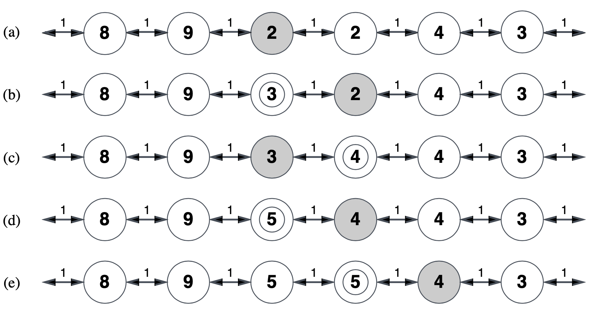

# Lezione 7 - Ricerca online e soddisfacimento di vincoli
Giovedì 17 ottobre 2019

Nelle precedenti puntante: Hill climbing con la risalita per trovare una funzione globale.

## Simulated Annealing

L'idea è quella di permettere delle mosse cattive per evitare i massimi locali (si ispira al processo di tempra dell'acciaio).

La frequenza di queste mosse va via via a calare e viene determinata da una distribuzione di probabilità nota che deriva da come le molecole di un metallo si muovono al variare della temperatura.

```
function SimulatedAnnealing(problema, velocità_raffreddamento) returns uno stato soluzione
	input: problema, un problema
			  velocità_raffreddamento, una corrispondenta dal tempo alla temperatura
	variabili locali: nodo_corrente, un nodo
						  successivo, un nodo
						  T, una temperatura che controlla la provbabilità di compiere passi verso il basso.
	nodo_corrente <- CreaNodo(StatoIniziale[Prolema])
	for t <- 1 to ∞
	   T <- velocità_raffreddamento[t]
	   if T == 0 then return nodo_corrente
	   successivo <- un successore di nodo_corrente scelto a caso
	   DeltaE <- Valore[successivo] - Valore[nodo_corrente]
	   if DeltaE > 0 then nodo_corrente <- successivo
	   else nodo_corrente <- successivo con probabilità e^(DeltaE/T)
```

Con il procedere dell'esecuzione si va diminuire la probabilità di fare scelte a caso

A temperatura fissata `T` la probabilità di occupazione degli stati segue la distrubuzione di Boltzmann.

$$p(x) = \alpha e^{\frac{E(x)}{kT}}$$

Se `T` viene diminuito abbastanza lentamente si raggiunge sempre lo stato migliore.

Questo viene usato largamente nelle applicazioni pratiche come la definizione degli orari dei voli delle linee aeree.

## Discesa di gradiente
Permette di effettuare ottimizzazione locale anche per sistemi non lineari. /* L'idea è che abbiamo delle variabili a dominio continuo e l'espressione è */
L'idea di base è partire da un vettore random $w$ che viene poi "spostato" nella direzione opposta a quella di massima crescita della funzione obiettivo (direzione trovata tramite il calcolo delle derivate). Se l'obiettivo è di massimizzare una funzione, si fa una ascesa di gradiente (e non una discesa, ovviamente!).

E' l'equivalente dell'hill climbing in cui lo spazio dei parametri sia continuo e la funzione obiettivo sia derivabile e con derivata diversa da zero. Nel senso, se la funzione obiettivo è a scalini, nella parte piatta avrà una derivata zero, e quindi il vettore ottenuto sarà nullo. In tal caso si cercano funzioni che "smussano" la funzione obiettivo in modo da eliminare i punti con derivata nulla.

## Ricerca online

Quando l'ambiente è dinamico o non totalmente osservabile o non deterministico non è possibile pianificare a priori le operazioni da compiere.

In questo caso è necessario interagire con l'ambiente per recuperare le informazioni mancanti.

Si parla quindi di _ricerca online_.

Si assume che l'agente conosca solo:

- Azioni(_s_): le azioni permesse nello stato _s_ . Da notare che si parla solo di azioni, non di effetti, i quali verranno osservati tramite le percezioni (si scoprirà solo vivendo);
- c(_s,a,s'_): il costo dell'azione _a_ per passare dallo stato _s_ a _s'_ (lo stato di arrivo non è noto finché non è stata applicata l'azione);
- TestObiettivo(*s*): per sapere se lo stato *s* è un obiettivo (deve essere sempre possibile).

Il problema principale di questo tipo di ricerca è che non esiste un algoritmo che permette di evitare vicoli cechi. Questo perché tipicamente non ci sono abbastanza infomrazioni riguardo l'ambiente di esecuzione, quindi si può utilizzare solo una tecnica di ricerca locale (ad esempio DFS).

Questi algoritmi non sono (ovviamente) completi.

### Ricerca in profondità online

L'idea è quella di esplorare l'ambiente alla ricerca di un goal.

```
function OnlineDFSAgent(s') returns an action
	inputs: s' una percezione che identifica lo stato corrente
	static:	result, una tabella indicizzata per azioni e stati, inizialmente vuota
				unexplored, una tabella che contiene, per ogni stato visitato, tutte le azioni che non sono ancora state eseguite
				unbacktracked, una tabella che contiene, per ogni stato visitato, i backtrack che non è ancora sono ancora stati provati
				s,a, lo stato precedente e l'azione precedentemente eseguita.
	if GoalTest(s') return stop
	if s' is a new state then unexplored[s'] <- Actions[s']
	if s is not null then do
		result[a,s] <- s'
		add s to the front of unbacktracked[s']
	if unexplored[s'] then
		if unbacktracked[s'] is empty then return stop
		else a <- an action b tale che result[b,s'] = Pop(unbacktracked[s'])
	else a <- Pop(unexplored[s'])
	s <- s'
	return a
```
Perché l'algoritmo funzioni è necessario che l'agente possa tornare indietro dopo aver fatto un'azione.

Questo algoritmo può comunque finire in cammini infinti o in vicoli cechi.

### Ricerca casuale

L'idea è quella di esplorare l'ambiente in modo da recuperare la maggior quantità possibile di informazioni per poi andare applicare altri algoritmi. Rispetto alla ricerca sistematica, che tiene conto delle azioni precedenti, la ricerca random si muove molto più liberamente nell'ambiente.

Questa tipologia di ricerca termina con un successo se lo spazio è finito, ma in ogni caso può essere molto lenta.

Ad esempio nel caso il numero di archi che si allontanano dal goal è maggiore (doppio, nell'esempio delle slide) rispetto a quelli che vanno nel verso corretto.

Altre strategie come l'HillClimbing con memoria o LRTA\* permettono di ottenere risultati migliori.

### Learning Real Time A\* - LRTA\*

L'idea di base consiste nel memorizzare la migliore stima corrente `H(s)` del costo per raggiungere il goal da ogni stato visitato.

`H(s)` inizialmente coincide con `h(s)` ma durante l'esecuzione viene aggiornata con l'esperienza. Diciamo che è una versione aggiornata dell'euristica iniziale e funziona in modo analogo alle versioni ricorsive e con uso di memoria ottimizzata di A* (tipo SMA*)




```
function LRTA*-Agent(s') returns an action
	inputs:	s', una percezione dello stato corrente
	static:	result, una tabella indicizzata per azione e stato inizialmente vuota
				H, una tabella dei costi stimati inidicizzati secondo lo stato, inizialmente vuota
				s,a, lo stato e l'azione precendente
	if GoalTest(s') then return stop
	if s' is a new state (not in H) then H[s']<-h(s')
	unless s is null
		result[a,s] <- s'
		H[s] <- Min tra Actions(s) tra LTRA*-Cost(s,b,result[b,s],H)
	a <- an action b in Action(s') minimizing LTRA*-Cost(s',b, result[b,s'],H)
	s <- s'
	return a

function LTRA*-Cost(s,a,s',H) returns a cost estimate
	if s' is undefined then return h(s)
	else return c(s,a,s') + H[s']
```

Anche in questo caso si ha la garanzia di trovare una soluzione solo se gli stati sono finiti e le azioni sono revesibili, altrimenti non può essere completo.

L'algoritmo comunque richiede che le azioni siano deterministiche, altrimenti le scelte dovrebbero essere interpretate con la loro distribuzione di probabilità

*Questo termina la parte riguardante gli algoritmi generici*

# FINE!

## Problemi di soddisfacimento dei vincoli

In questa tipologia di problemi lo stato è una black box, una qualunque struttura dati che supporta il test di goal, la funzione di valutazione e la funzione successore.

In un CSP (*constraint satisfaction problem*) lo stato è definito da delle variabili `X`, con valori di domino `D` (ogni variabile x<sub>i</sub> ha come dominio D<sub>i</sub>).

Il test di goal è un insieme di vincoli che specificano combiniazioni ammissibili di valori per sottoinsieme di variabili.

È possibile definire degli algoritmi specializzati più potenti di quelli generici.

*esempio della colorazione di una cartina*


