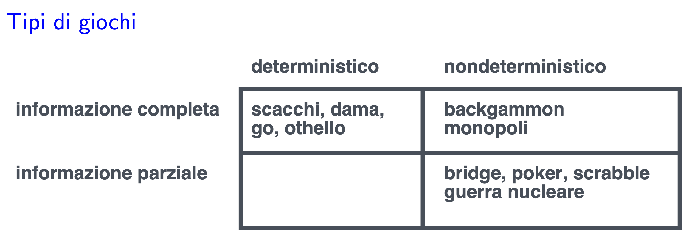
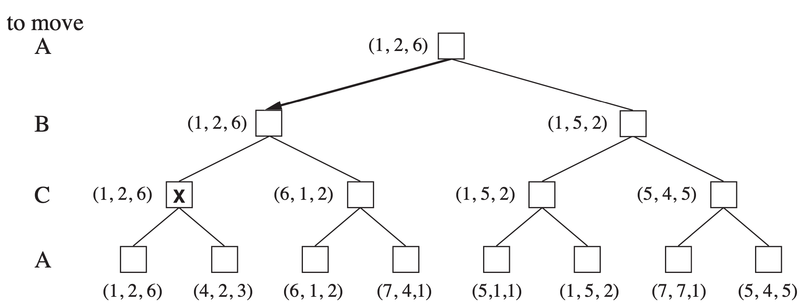

# Adversarial Search
22 Ottobre 2019

## Giochi vs problemi di ricerca

Nel caso della ricerca c'è un agente che cerca una soluzione, mentre nel caso dei giochi ci sono da due a più agenti che tipicamente competono tra di loro. Nel caso di soli due giocatori si parla di competizione (_adversarial search_): quello che è utilità per l'agente diventa disutilità per l'avversario. Per questo motivo si parla di giochi a somma zero (utilità agente + utilità avversario = 0). 

L'avversario è imprevedibile e ogni azione che l'agente può eseguire deve avvenire all'interno di un limite temporale. 

Non c'è più uno spazio di ricerca statico, perché si ha a che fare con un avversario che è un'entità imprevedibile, quindi la soluzione al problema non è più un cammino da uno stato iniziale ad uno stato finale (questo perché non è più il singolo giocatore che effettua tuttele mosse).

In questo caso c'è un altro agente che decide in autonomia come contrastare il cammino del primo giocatore.

La soluzione diventa quindi una strategia, una funzione che specifica una mossa per ogni possibile mossa dell'avversario.

In alcuni casi ci sono anche dei limiti di tempo codificati nelle regole del gioco, le possibilità di ricerca sono quindi limitate e non sempre è possibile arrivare ad una strategia ottima.

## Tipi di giochi

Possiamo classificare i giochi in questo modo:



- Informazione completa e deterministici: come la dama, gli scacchi, othello;
- Informazione completa e non deterministici: backgammon, monopoli;
- Informazione parziale e non deterministici: poker, risiko, briscola.

Possono essere aggiunte anche altre informazioni, come online/offline.

## TicTacToe

*Nelle slide c'è un esempio di albero di gioco*

Sono presenti due funzioni, Max(x), Min(o) che rappresentano i due giocatori, i quali a turno mettono il loro simbolo nella griglia. 

Vince il primo che riesce ad allineare 3 simboli uguali, altrimenti c'è una patta.

I nomi derivano dal fatto che Max cerca di massimizzare la funzione di utilità (scopo del giocatore) mentre Min cerca di minimizzarla (scopo dell'avversario).

L'albero di gioco rappresenta tutte le possibili situazioni. Ogni foglia rappresenta un esito, la cui utilità può essere negativa (ha vinto l'avversario), positiva (ha vinto il giocatore) o nulla (parità).

Questo gioco viene detto a **somma zero** o costante, questo perché il vantaggio di un giocatore equivale allo svantaggio dell'avversario.

## Minimax

Algoritmo che si applica in caso di gioco perfetto per giochi deterministici e ad informazione perfetta.

L'idea è quella di scegliere la mossa che conduce alla posizione con valore *minimax* più alto che equivale al miglior vantaggio raggiungibile con un avversario che gioca in modo ottimo.

*ply*: mossa di un giocatore, un turno di gioco è composto da 2 ply.


Con questo algoritmo si cerca di massimizzare l'utilità nel caso pessimo in quanto si suppone che l'avversario stia giocando in modo ottimo. Nell'esempio, se il giocatore ha la prima mossa sceglierà $a_1$ in quanto, male che vada, può ottenere una utilità 3 (siccome le mosse sono alternate, una volta nel nodo B toccherà all'avversario, che ovviamente sceglierà $b_1$, ovvero la mossa che minimizza l'utilità)

In pratica l'algoritmo lavora creando l'albero delle possibili mosse e propagando l'utilità dal basso verso l'alto, considerando ad ogni altezza di chi è il turno: se è il turno dell'avversario (giocatore MIN) si propagherà il valore minore tra le possibili scelte, mentre se è il turno del giocatore MAX (il giocatore corrente) si propagherà il valore più alto tra le scelte. Nel caso in cui più di una mossa dia lo stesso valore, se ne sceglie una a nostra discrezione. 

```javascript
function MiniMaxDecision(state) returns an action
    inputs: state, current state in game
    v <- MaxValue(state)
    return the action in Successor(state) with value v
    
function MaxValue(state) returns a utility value
    if TerminalTest(state) then return Utility(state)
    v <- -∞
    for a,s in Successors(state) do
        v <- Max(v, MinValue(s))
    return v
    
function MinValue(state) returns a utility value
    if TerminalTest(state) then retrun Utility(state)
    v <- ∞
    for a,s in Successors(state) do
        v <- Min(v, MaxValue(s))
    return v
```

La funzione `MaxValue` cerca di massimizzare la funzione d'utilità quando gioca Max, mentre `MinValue` cerca di minimizzare la funzione funzione d'utilità quando gioca Min.

### Caso di tre giocatori
Basta attribuire ad ogni giocatore il suo valore di utilità. Ogni nodo avrà quindi un vettore con tre elementi, uno per giocatore, che rappresentano la sua utilità nei confronti di un giocatore.



Nel caso in cui ci siano più scelte aventi la stessa utilità, scelgo io. Potrebbe essere intelligente scegliere l'opzione che minimizza l'utilità altrui (ma tanto non cambia)

### Proprietà

L'algoritmo è completo solo se l'albero degli stati è finito.

Nel caso in cui l'albero sia infinito non è mai possible raggiungere le foglie e quindi non è garantita la completezza. Da notare che se l'albero è infinito la strategia di gioco può essere finita.

L'algoritmo risulta ottimo sia se entrambi i giocatori giocano in modo ottimo, sia nel caso l'avversario giochi in modo non ottimo (se l'avversario gioca in modo non ottimo è scarso, quindi perderà prima!).

Questo perché Max quando può vincere, va a vincere e se l'avversario gioca in modo sub-ottimo, Max riesce a vincere anche in situazioni in cui non avrebbe vinto.

La complessità in tempo è $O(b^m)$, dove *b* è il fattore di branching e *m* la profondità della soluzione (numero molto elevato).

Questo perché l'algortimo deve esaminare tutto l'albero fino alle foglie per poter calcolare i valori per i nodi interni. 

La complessità in spazio invece è $O(bm)$ con esplorazione depth-first.

Il gioco degli scacchi ha in media *b = 35* e *m = 100* in caso di avversari normali (cioè dove non si "tira alla lunga"), non è quindi possibile trovare una soluzione perfetta.

## 𝜶 - 𝜷 pruning

Vengono fatte delle considerazioni per evitare di espandere dei rami che portano a situazioni disastrose. L'idea è quindi di potare l'albero di ricerca (simile alla ricerca in profondità ricorsiva): se teniamo l'informazione su quanto è il meglio che siamo riusciti a scoprire ed, esplorando un altro cammino ci accorgiamo che non ci porterà ad una soluzione migliore, potiamo il cammino.

$\alpha-\beta$ pruning fa proprio questo, mantenendo salvati due valori:

𝜶 = valore della scelta migliore per Max al di fuori del cammino corrente

𝜷 = valore della scelta migliore per il giocatore Min al di fuori del cammino corrente

Questa ricerca aggiorna i valori di 𝜶 e 𝜷 man mano che procene e pota i rami restanti non appena il valore del nodo è minore di quello di 𝜶 quanto tocca a Min e maggiore di 𝜷 per Max.

### Perché 𝜶 - 𝜷?

𝜶 è il miglior valore per Max trovato al di fuori del cammino corrente, se V è peggiore di Max questo verrò evitato, lo stesso vale per 𝜷.

### Codice

```javascript
function AlphaBetaSearch(state) return an action
    inputs: state, current state in game
    v <- MaxValue(state, -∞, +∞)
    return the action in Successros(state) with value

function MaxValue(state, 𝜶, 𝜷) retrun a utility value
    inputs: state, current state in game
            𝜶, the value of the best alternative for Max along the path to state
            𝜷, the value of the best alternative for Min alogn the path to state
    if TerminalTest(state) then return Utility(state)
    v <- -∞
    for a, s in Successors(state) do
        v <- max(v, MinValue(s, 𝜶, 𝜷))
        if v >= 𝜷 then return v
        alfa = Max(𝜶, v)
    return v

function MinValue(state, 𝜶, 𝜷) returns a utility value
    inputs: state, current state in game
            𝜶, the value of the best alternative for Max along the path to state
            𝜷, the value of the best alternative for Min alogn the path to state
    if TerminalTest(state) then return Utility(state)
    v <- +∞
    for a, s in Successors(state) do
        v <- min(v, MaxValue(s, 𝜶,𝜷))
        if v <= 𝜶 then return v
        beta = Min(𝜷, v)
    return v

```

### Prestazioni e proprietà

Nel caso ottimo in cui le mosse sono ordinate per funzione di utilità, quindi decrescente quando cerca max, *(trovo subito il massimo)*, crescente quando cerca min *(trovo subito il minimo)*, si riesce a raddoppiare la profondità raggiungibile (complessità in tempo arriva a $O(b^{m/2})$), mentre nel caso pessimo non si ha nessun miglioramento (quindi ci si ritrova con _MinMax_).

Questa strategia non va a modificare il risultato finale in quanto vengono scartate solamente stati non ottimi.

La differenza di prestazioni determinata dall'ordine fa notare come un sistema "intelligente" dovrebbe ordinare prima le mosse e poi via.

### Analisi del best case (ordine perfetto)
Per avere il valore esatto di uno stato occorre:
* conoscere il valore esatto di utilità per uno stato figlio
* conoscere un bound sulla utilità di tutti gli stati figli rimanenti

Per derivare un bound sulla utilità dello stato occorre:
* 

Quindi se poniamo $E(d)$ come il numero minimo di stati da considerare per conoscere il valore di utilità di uno stato a distanza *d-ply* dagli stati terminali e $B(d)$ come il numero minimo di stati da considerare per conoscere un bound sul valore di utilità di uno stato a distanza *d-ply* dagli stati terminali, abbiamo:

$$E(d+1) = E(d)+(b-1)B(d)$$
$$B(d+1) = E(d) $$

[...]
quindi si ottiene:

$$ E(m) \le (\sqrt{2b})^m = (\sqrt 2)^mb^{m/2} $$

ovvero l'esponente di b cresce di uno ogni due livelli
