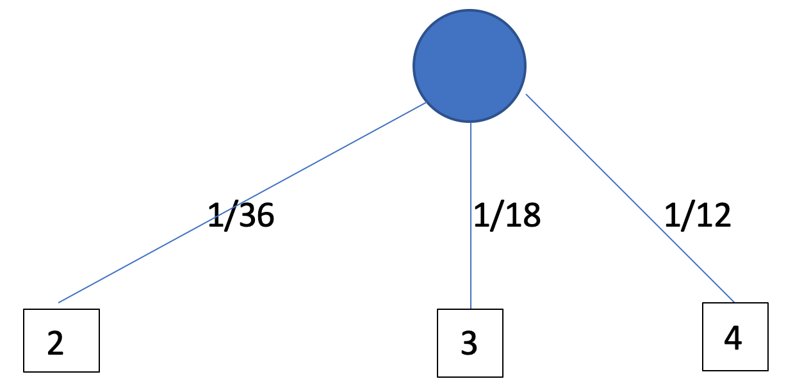

# Lezione 8 - Proprietà alpha-beta pruning. Analisi best case. Limite alle risorse. Funzioni di valutazione. Ricerca con taglio. Giochi nondeterministici. Nodi di chance. Potatura per alberi di gioco nondeterministici.  Giochi a informazione parziale. Esempi e analisi corretta.

Giovedì 24 Ottobre 2019

## Limiti alle risorse

Si suppone di avere un limite al tempo per calcolare le mosse.

Serve quindi una **funzione di valutazione** che può essere applicabile sia ad una foglia e in questo caso funziona da funzione di utilità, sia ad uno stato centrale e in questo caso fornisce una stima della *desiderabilità* dello stato in cui si trova, una sorta di funzione euristica.

Serve inoltre un **test di taglio (cutoff)** che pone un limite all'albero di ricerca, raggiunto il quale viene calcolata la funzione di valutazione.

Con il cutoff c'è un problema in quanto può capitare che per raggiungere uno stato molto favorevole è necessario andare a sacrificare dei pezzi, passando cioè per degli stati svantaggiosi. (Ad esempio il sacrificio di un pezzo nel gioco degli scacchi).

Conviene quindi utilizzare una ricerca di **quiescienza** cioè tagliando la ricerca solamente quando la funzione di valutazione per una serie di nodi non cambia di molto.

Se invece tra nodi successivi c'è un cambio notevole tra le funzioni di valutazioni, allora si tengono delle risorse per andare ad esplorare quell'area dell'albero.

### Funzione di valutazione

È una funzione usata per calcolare il valore degli stati.

Negli scacchi la funzione risulta essere un combinazione lineare pesata di varie caratteristiche, come ad esempio il numero di pedine bianche o nere pesate con la loro importanza (es: regina vale 9, torre 8, cavallo 7 ecc..). I pesi possono essere dati all'inizio/staticamente oppure possono essere appresi (tramite machine learning).

La funzione lineare garantisce l'indipendenza del valore di ogni componente, mentre con le funzioni non lineari questo non succede in quanto possono essere considerate coppie di pezzi.

Come per la funzione euristica c'è un trade-off sulla bontà dell'euristica, perché può capitare che sia necessario tagliare prima per avere più tempo a disposizione in modo da poter calcolare un euristica buona, oppure si può scegliere di esplorare più nodi ed avere una stima più grossolana e veloce da calcolare.

Tipicamente si preferisce la profondità.

La cosa importante della funzione di valutazione non è la stima precisa ma la valutazione corretta della "bontà" di uno stato, cioè che la funzione sia monotona, questo perché la funzione deve semplicemente esplicitare il vantaggio di un giocatore piuttosto che dell'altro in modo coerente nel tempo.

Infatti, quello che conta è solamente l'ordine di vista degli stati. 

Il guadagno in giochi deterministici agisce come una funzione di utilità *ordinale*.

### Ricerca con taglio

`MinimaxCutoff` è identico a `MinimaxValue` con la differenza che:

- `Terminal` viene rimpiazzata da `Cutoff`: non arrivo alla fine ma mi fermo ad un certo punto;
- `Utility` viene rimpiazzata da `Eval`: la funzione di utilità viene sostituita con la funzione di valutazione.

#### Benchmark ricerca con taglio:
Siccome possiamo fare al massimo $10^6$ mosse ogni 100 secondi e per ogni turno di scacchi mediamente si possono fare 35 mosse diverse, possiamo fare al massimo *4ply* (mossa, contromossa, mossa, contromossa), che corrisponde al livello di un giocatore pessimo. 
Le prestazioni sono quindi abbastanza limitate/scarse, ma applicando l' $\alpha-\beta$ pruning, si riesce ad arrivare (nel caso migliore) ad *8-ply* con un pc normale, che corrisponde al livello di un esperto. Deep Blue e Kasparov arrivavano ad *12-ply*

La ricerca di quiescenza permette di capire quanto stabile è la valutazione dei nodi che sono sul confine dell'esplorazione.

## Giochi non deterministici

Sono giochi in cui sono presenti degli eventi casuali (*chance*) introdotti mediente dadi, carte prese a caso, lancio in una moneta, ecc. Ad esempio nel backgammon il sottoinsieme di mosse disponibili è dato dal risultato del lancio di due dadi (devo muovere *n* pedine, dove *n* è la somma dei due dadi)

Nei giochi deterministici si riesce a propagare il valore di utilità dalle foglie ai nodi interni, mentre nei giochi non deterministici, a causa del non determinismo, non si riesce ad avere la certezza ma una probabilità. Non si ragiona più in termini di funzioni deterministiche ma di valore aspettato di utilità (che il giocatore deve massimizzare).

Nell'albero viene introdotta una nuova tipologia dei nodi detti *chance* e che Max utilizza per valutare la mossa da fare.


Il valore aspettato di uno nodo chance dipende dalla probabilità dei vari valori dei figli del nodo chance. L'idea è che il Min cerchi sempre di minimizzare i valori di utilità, che sono però non deterministici (utilità aspettata/attesa). Quando però l'informazione viene passata a *Max*, essa viene "filtrata" dai nodi di chance, che fanno una media pesata delle utilità aspettate che arrivano dai possibili eventi della variabile stocastica. Nell'esempio, risalendo dai due rami più a sinistra, viene passato al nodo max $2 * 0.5 + 4 * 0.5 = 3$. Da notare che un gioco come backgamon che prevede prima il lancio di dadi e poi la scelta delle mosse, inizierebbe subito con un nodo di chance.



La strategia sta quindi nel scegliere le mosse che massimizzano il valore aspettato di utilità.

La presenza dei nodi chance fa aumentare il numero di nodi dell'albero, perché adesso data una mossa di Max ho due o più possibili mosse di Min.

### ExpectMiniMax

Funziona come Minimax con l'eccezione che si devono trattare anche gli eventi casuali.

```
...
if state is a Max node then
    return the highest ExpectiMiniMax-Value of Successors(state)
if state is a Min node then
    return the lowest ExpectiMiniMax-Value of Successors(state)r
if state is a Chance node then
    return average ExpectiMiniMax-Value of Successors(state)
...
```


### Potatura in alberi da gioco non deterministici

Si riesce comunque a fare una potatura 𝜶-𝜷 solo che risulta meno efficace.


### Giochi non deterministici in pratica

L'uso dei dadi aumenta il valore del fattore di branching *b* e questo va a riidurre il valore di lookahead (ovvero diminuisce il numero delle mosse future che posso esplorare).

Nonostante la complessità aumenti si riesce comunque ad ottenere dei risultati buoni (sfruttando anche alcune cose non ancora affrontate).

In questo caso è importante che la funzione di valutazione sia composta da trasformazioni (si intende in merito ai veri valori di utilità) lineari e positive, altrimenti non si riesce a preservare l'ordine dei nodi chance. Non è dunque sufficiente che la funzione sia solo monotona (come avveniva invece per i giochi deterministici)!

FINE
---

## Giochi ad informazione parziale

In questa tipologia di giochi non si hanno tutte le informazioni riguardo le mosse che può fare l'avversario (esempio tipico sono i giochi di carte).

C'è stata la proposta di ridurre questi giochi in giochi non deterministici, considerando tutte le possibili smazzate come se si avesse un dado con tante facce.

Questa strategia funziona, ma non è corretta.

Perché nel caso di informazione parziale una strategia ottima potrebbe fare delle mosse solamente per acquisire ulteriori informazioni, mentre nel caso non deterministico questa tipologia di mosse non viene presa in considerazione in quanto si da per scontato di avere a diposizione tutta l'informazione.

È più corretto che il valore di un azione dipenda dallo stato di informazione o **stato di credenza** in cui si trova l'agente ed è possibile generare e ricercare all'interno di un albero di stati di credenza.

Questo conduce a comportamenti razionali quali:

- Agire con lo scopo di ottenere infomrazione;
- Trasmettere informazione al proprio compagno di gioco;
- Agire in modo casuale per minimizzare la perdita di informazione (fornire informazioni agli avversari).

## Riassumendo i giochi

I giochi sono stati i primi esempi di intelligenza artificiale, si è partiti dai giochi deterministici sfruttando anche lo sviluppo tecnologico.

Le cose si complicano notevolmente quando l'informazione è parziale o il gioco non è deterministico.

L'approssimazione risulta quindi molto importante dal momento che non è possibile raggiungere la perfezione per motivi computazionali.

VINCOLI (FINE)
----

**CSP Binario**: ogni vincolo si riferisce ad al più due variabili.

**Grado dei vincoli**: i nodi del grafo sono le variabili del CSP e gli archi rappresentano i vincoli.

Considerando un CSP come un grafo è possibile utilizzare le proprietà del grafo per velocizzare la ricerca di una soluizone.

## Varietà di CSP

Tipicamente le variabili dei problemi CSP sono discrete.

I loro domini possono essere *finiti* o *infiniti*.

In alcuni casi è necessario utilizzare un linguaggio per definire vincoli.

Solamente i vincoli lineari sono risolvibili, mentre la risolvibilità di quelli non lineari non è decidibile.

C'è anche la possibilità di utilizzare variabili continue con vincoli lineari, in questo caso la risoluzione dei vincoli avviene con il metodo del simplesso (programmazione lineare) con complessità esponenziale nel caso pessimo (polinomiale tipicamente).

I vincoli possono essere:

- **unari**: coinvologono una sola variabile;
- **binari**: coinvologono due variabili:
- **di ordine superiore**: coinvolgono più di due variabili;
- **prefenze (o soft)**: trammite l'assegnamento di un costo ad ogni variabile, un esempio di questo vincolo è preferire il rosso al verde nel problema della colorazione di una cartina. (il problema diventa un problema di ottimizzazione vincolata, vengono prefreite le soluzioni di costo minore)

## Formulazione di ricerca standard

Gli stati vengono definiti dai valori assegnati fino ad un dato momento.

**Stato iniziale**: l'assegnamento vuoto.

**Funzione successore**: assegna un valore ad una variabile non ancora assegnata che è compatibile con l'assegnamento corrente. Questa funzione fallisce se non esiste un assegnamento legale.

**Test di goal**: l'assegnamento corrente è completo, tutti i vincoli sono soddisfatti.

Proprietà:

1. Valido per tutti i CSP;
2. Ogni soluzione appare a profondità *n* con *n* variabili (tutti gli stati a profondità *n* sono soluzioni, questo per costruzione, perché altrimenti non sarei riuscito a scendere fino a tale profondità), conviene quindi usare la ricerca depth-first;
3. Il cammino è irrilevante, interessa solo lo stato (anche una soluzione locale può andare bene);
4. A profondità *l* il fattore di branching (cioè nodi nella frontiera) è tipicamente *(n-l)\*d*.

## Ricerca con Backtracking

Gli assegnamenti sono tra loro commutativi.

Utilizzare il backtracking nella ricerca depth-first consiste nel tornare indietro di un nodo e utilizzare un altro valore per l'assegnamento.

La ricerca con backtracking è l'algoritmo non informato di base per risolvere i CSP.

```
function BacktrackinSearch(csp) returns solutions/failure
	return RecursiveBacktracking([],csp)

function RecursiveBacktracking(assigned, csp) return sorultion/failure
	if assigned is complete then retun assigned
	var <- SelectUnassignedVariable(Variables[csp], assignd, csp)
	for each value in OrderDomainValue(var, assigned, csp) do
		if value is consistent with assigned according to Constraints[csp] then
			result <- RecursiveBackracking([var = value | assigned], csp)
			if result != failure then return result
	end
	return failure
```

### Miglioramenti dell'efficienza

Aggiungendo degli accorgimenti ai vari assegnamenti è possibile andare a migliorare l'efficienza dell'algoritmo.

1. Quale variabile si deve assegnare al prossimo passo?
2. In quale ordine testare i valori del dominio?
3. È possibile rilevare a priori dei fallimenti inevitabili?
4. È possibile sfruttare la stuttura del problema? (es: il problema è composto da più sotto-problemi tra loro indipendenti oppure la stuttura dei vincoli è simmetrica)

#### Assegnamenti delle variabili

Una euristica che porta ad un miglioramento è quella di scegliere come prossima variabile da assegnare quella **più vincolata** cioè con il minor numero di valori possibili. In questo modo scopro prima se sto andando verso un assegnamento che non può essere completato.

Se ci sono più variabili con lo stesso numero di vincoli, tra queste conviene scegliere quella che ha **più vincoli con variabili non assegnate**, perché è quella che scegliendo un valore vincola maggiormente la scelta delle altre.

Una volta scelta la variabile, posso scegliere di assegnarle il valore **meno vincolante**, cioè quello che esclude meno valori tra quelli possibili delle variabili non ancora assegnate.

#### Foward checking

*attività di propagazione dei vincoli*

L'idea è quella di tenere traccia dei rimanenti valori legati per le variabili non assegnate. Viene terminata la ricerca se c'è qualche variabile che rimane senza valori legali.

Dopo un assegnamento si va a controllare come cambiano i domini delle altre variabili.

Questa cosa prende il nome di **constraint propagation** e ci sono vari algortimi che permettono questi, vedi corso di Sistemi Con Vincoli.

#### Struttura del grafo

Se il grafo è composto da sotto-problemi tra loro indipendenti, conviene risolverli separatamente e poi combinare tra loro le soluzioni.

In alcuni casi il guadagno temporale risulta estremo, si passa da miliardi di anni a qualche secondo.

Inoltre, se il grafo associato al CSP ha una struttura ad albero, ovvero non ha vincoli, il CSP può essere risolto in *O(nd<sup>2</sup>)*.

Questo perché si può scegliere un ordine delle variabili che sia consistente con la topologia del grafo.

## Algoritmi iterativi per CSP

Per risolvere un CSP è possibile utilizzare sia Hill-Climbing che Simulated Annealing, in quanto questi lavorano con stati "completi", cioè che hanno tutte le variabili assegnate.

Per applicarli ad un CSP è necessario permettere stati con vincoli non soddisfatto e degli operatori che permettono di riassegnare valori ad una variabile.

La selezione della variabile viene fatta in modo casuale tra quelle che hanno dei conflitti, mentre come valore per la variabile si usa l'euristica del minimo conflitto, utilizzando quindi la funzione classica `h(n) = numero totale di vincoli violati`.

### Presetazioni di min-conflicts

Dato una stato iniziale random, si può risolvere n-regine per n arbitrario in un tempo costante con alta probabilità.

Questo sembra essere vero per ogni CSP generato a caso, tranne che per un intervallo ristretto, del rapporto:

```
R = numero di vincoli / numero di variabili
```


