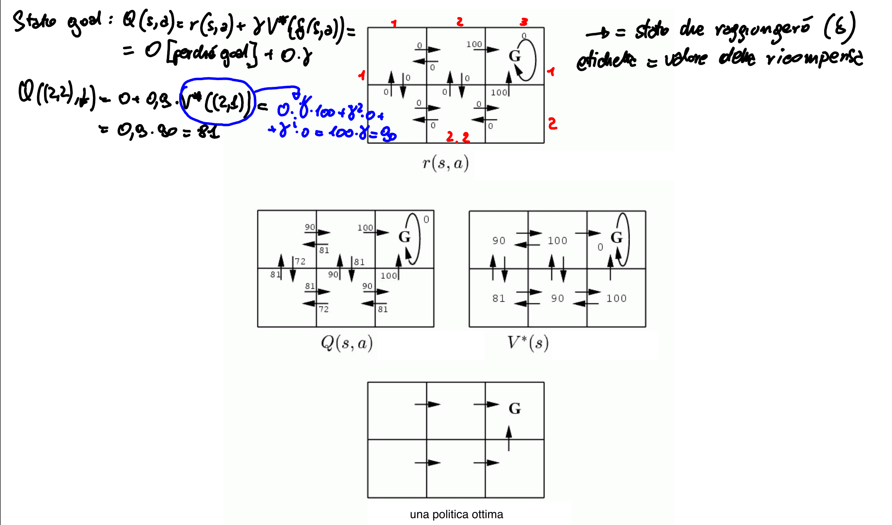
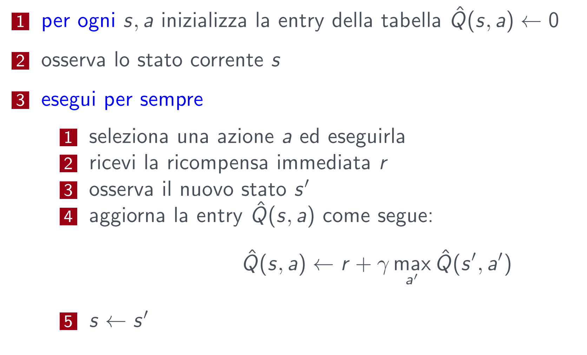
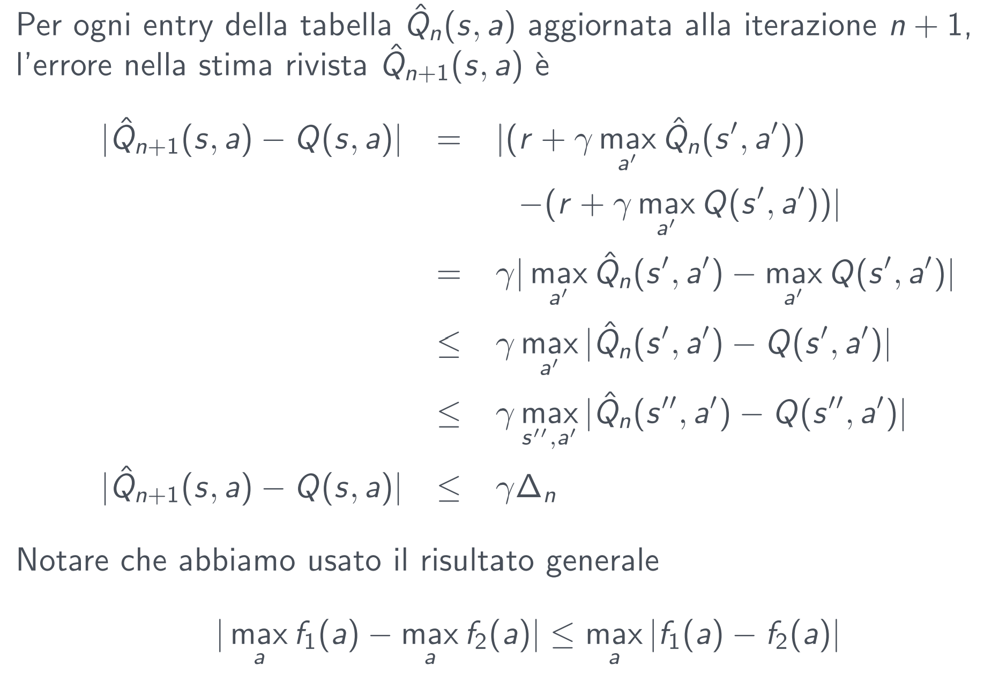

# Lezione 19 - Apprendimento con rinforzo

E' uno dei 3 paradigmi principali dell'apprendimento automatico. E' adatto nell'ambito dell'intelligenza artificiale perché si tratta di un agente in un ambiente. L'agente può:

- Trovarsi in uno **stato s**
- Eseguire un'azione **a**

Per ogni azione svolta riceve una ricompensa. Lo scopo dell'agente è quindi massimizzare una funzione delle ricompense:
$\sum_{t=0}^{\infty} \gamma^t r_t$,  dove $0 < \gamma < \infty$

La scelta del parametro $\gamma$ permette di caratterizzare il comportamento dell'agente: l'agente può puntare a incrementare subito il valore della funzione oppure essere più "lungimirante"

## Processo di decisione di Markov

Si assume:

- Un insieme finito di stati S
- Un insieme di azioni A
- Ad ogni istante di tempo t l'agente osserva lo stato $s_t \in S$ e sceglie l'azione $a_t \in A$
- Riceve poi una ricompensa immediata $r_t$
- e cambia lo stato in $s_{t+1}$

Il problema è che, se l'agente deve salvarsi la storia delle azioni, si ha un'esplosione combinatoria dello spazio necessario. Per questo motivo si fa l'assunzione che lo stato in qualche modo "riassuma" la storia (o quanto meno, la parte necessaria) utile per l'ottimizzazione ($s_{t+1} = \delta(s_t,a_t)$). La stessa cosa vale per la ricompensa ($r_{t} = r(s_t,a_t)$). In altre parole, **si assume** che l'insieme di stati che viene utilizzato per definire l'agente è sufficente per la soluzione del problema.

Inoltre, le funzioni $\delta$ e $r$ possono essere deterministiche o nondeterministiche. Infine, in base all'osservabilità dell'ambiente, $\delta$ e $r$ possono essere _conosciute_ o _ignote_. Tipicamente però, queste funzioni non sono conosciute e tramite l'interazione con l'ambiente si cerca di "ricostruirle" (più o meno). Se poi $\delta$ e $r$ sono _non deterministiche_, il problema diventa più complesso.

## Compito di apprendimento per l'agente

Il compito dell'agente è quello di eseguire delle azioni nell'ambiente, osservarne i risultati e:

- Apprenderne la politica (per le azioni) $\pi : S \to A$ che massimizza $E[r_t + \gamma r_{t+1} + \gamma^2 r_{t+2}+..]$ per ogni stato iniziale S. Da notare che $\pi$ è una funzione, quindi mappa ogni stato ad __una e una sola azione__. Quindi, in questo tipo di modellazione, la storia è codificata nello stato, per cui a prescindere dall'istante temporale, due stati uguali condurranno alla stessa azione!!
- $0 < \gamma < 1$ è il **fattore di sconto** per ricompense future.

La differenza tra tutti gli altri tipi di apprendimento (supervisionato e non supervisionato) è che la funzione target è $\pi$, ma non si hanno a disposizione gli esempi di tipo $input \to output$, ma sono del tipo $(s,a) \implies r$. Non è possibile usare le stesse tecniche dell'apprendimento supervisionato (come il perceptron con discesa di gradiente).

## La funzione di valutazione

Per ogni possibile politica $\pi$ possiamo definire una funzione di valutazione sugli stati:

$$
V^\pi(s) \equiv r_t + \gamma r_{t+1} + \gamma^2 r_{t+2} + ... \equiv \sum_{i=0}^\infty \gamma^i r_{t+i}
$$
dove $r_i$ sono generati seguendo la politica $\pi$ a partire dallo stato $s$. Quindi, posso decidere qual'è la politica migliore partendo da un certo stato applicando la politica in modo ricorsivo a partire da $s$. Si può formalizzare il compito dell'apprendimento com quello di trovare $\pi^*: arg\, max_\pi V^\pi(s), (\forall s)$

L'agente potrebbe fare una ricerca in avanti per scegliere la migliore azione da ogni stato $s$ perché:
$\pi^*(s) = arg\, max_a[r(s,a) + \gamma V^*(\delta(s,a))$, considerando il valore dello stato come composto da due fattori:

1. La ricompensa che si ottiene applicando l'azione $a$ nello stato $s$
2. La somma delle ricompense che posso ottenere dalle azioni "future" (ovvero quelle che compio dagli stati successori)

## La funzione Q

Se non si conoscono $\delta$ e $r$, non si può applicare la formula precedente. La soluzione è quella di definire una funzione $Q$ simile a $V^*$ come:

$$
Q(s,a) \equiv r(s,a) + \gamma V^*(\delta(s,a))
$$

quindi $\pi^*(s)$ diventa:

$$
\pi^*(s) = arg\, max_a Q(s,a)
$$

> **NOTA**: assumiamo che l'ambiente sia immutabile!!

Si noti che Q e V* sono intimamente correlate:

$$
V*(s) = max_{a'}\,Q(s,a')
$$

In questo modo posso riscrivere $Q$ ricorsivamente:

$$
Q(s_t,a_t) = r(s_t,a_t) + \gamma\cdot V*(\delta(s_t, a_t)) \\ = r(s_t, a_t) + \gamma\cdot max_{a'} Q(s_{t+1}, a')
$$

Se poniamo $\hat{Q}$ come la funzione corrente appresa dall'agente che approssima Q, si può considerare la seguente regola di apprendimento: 
$\hat{Q}(s,a) \leftarrow r + \gamma \cdot max_{a'} \hat{Q}(s',a')$

dove $s'$ è lo stato risultante dall'applicazione dell'azione $a$ allo stato $s$.

## Algoritmo Q-learning

Si crea una tabella dove nelle righe mette gli stati e nelle colonne le azioni (o viceversa). In pratica la tabella contiene tutte le coppie $(s,a)$ generabili.

Il problema è nel punto 3-1: come si seleziona l'azione a? Si hanno due possibilità:

- Scelta random: conviene inizialmente, perché ci garantisce che prima o poi le proviamo tutte e quindi esploriamo l'ambiente.
- Azione che massimizza il valore di $\hat{Q}$: chiamata anche fase di sfruttamento, posso "sfruttare" la conoscenza che ho dell'ambiente per puntare a massimizzare il valore di Q (e quindi la ricompensa totale).

Il problema è che non c'è una regola che dice a priori quando passare dalla scelta random allo sfruttamento! Se si passa allo sfruttamento troppo presto, si rischia di non trovare la soluzione ottima (perché ho stimato male quali sono le azioni migliori di ogni stato). Anche per questo l'apprendimento con rinforzo è un metodo di apprendimento lento: bisogna interagire più volte con l'ambiente!

## Esempio di applicazione

> Te lo fai

Se le ricompense sono non negative, allora:

$$
(\forall s, a, n)\,\,\, \hat{Q}_{n+1}(s,a) \ge \hat{Q}_n(s,a) \\
(\forall s, a, n)\,\,\, 0 \le \hat{Q}_n(s,a) \le {Q}(s,a)
$$

Questo di fatto ci permette di dimostrare la convergenza: continuando ad iterare l'algoritmo la stima $\hat{Q}$ converge a $Q$, sotto le condizioni che le azioni siano scelte in modo _fair_ (azioni scelte con una distribuzione di probabilità uniforme) e che la raggiungibilità degli stati sia completa (se parto da qualsiasi stato iniziale $s$ posso raggiungere tutti gli altri stati del problema).

Prova:Definiamo un intervallo pieno un intervallo durante il quale ogni $(s, a)$ è visitato. Durante ogni intervallo pieno l’errore più grande nella tabella
$\hat{Q}$ è ridotto di un fattore $\gamma$. Infatti, sia $\hat{Q}_n$ la tabella dopo n aggiornamenti, e $\delta_n$ l’errore massimo in $\hat{Q}_n$, cioè:
$$\delta_n = max_{s,a} | \hat{Q}_n(s,a) - Q(s,a) |$$

Seguono un po' di equivalenze:

Nel caso non deterministico, dobbiamo andare a considerare il valore aspettato della ricompensa immediata ($r(s,a)$) e $\gamma$ volte $V^*$, che è definito in maniera probabilistica.

Per apprendere, cambia la regola di aggiornamento, perché devo fare una sorta di "media mobile" dei valori $\alpha_n = \frac{1}{1 + visite_n(s,a)}$. Inizialmente vaod a considerare come valore di $\alpha_n$ il valore 1 (e quindi si usa la regola del caso deterministico, perché abbiamo poche "statistiche"). Andando avanti con il numero di visite, l'idea è quella di riutilizzare la stima precedente, andando a dare sempre più peso al valore precedente aggiornando la media con il nuovo valore. Sotto determinate condizioni, anche questo approccio converge.